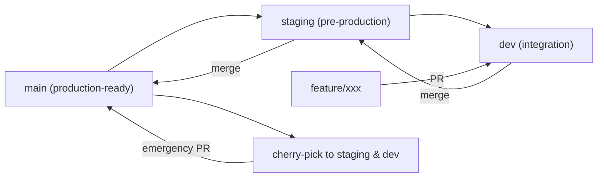
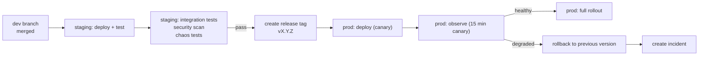
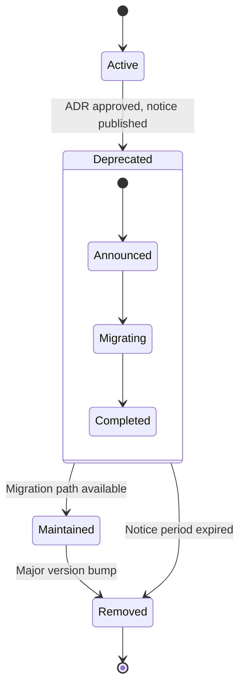

# AegisAI Enterprise Autonomous DevSecOps Platform — Engineering Standards

**Document Version:** 1.0  
**Applies To:** All code, configuration, and documentation in the AegisAI repository  
**Status:** Approved — Mandatory Engineering Standard  
**Last Updated:** 2026-07-02  
**Document Owner:** Chief Enterprise Architect  
**Governing Documents:** PROJECT_CONTEXT.md v1.0, SYSTEM_ARCHITECTURE.md v1.0

---

## Table of Contents

1. Executive Summary
2. Repository Standards
3. Folder Ownership Model
4. Coding Standards
5. Python Standards
6. Terraform Standards
7. Kubernetes Manifest Standards
8. Helm Standards
9. Docker Standards
10. API Design Standards
11. Git Standards
12. Branch Strategy
13. Commit Convention
14. Pull Request Standards
15. Code Review Standards
16. Documentation Standards
17. Logging Standards
18. Error Handling Standards
19. Testing Standards
20. Security Coding Standards
21. Secrets Management Standards
22. Configuration Standards
23. Dependency Management
24. Versioning Strategy
25. Release Standards
26. CI/CD Standards
27. GitOps Standards
28. Infrastructure Standards
29. AI Coding Standards
30. AI Prompt Standards
31. AI Review Standards
32. Naming Conventions
33. File Structure Rules
34. Repository Governance
35. Deprecation Policy
36. Technical Debt Policy
37. Quality Gates
38. Engineering KPIs
39. Future Evolution

---

## 1. Executive Summary

This document defines mandatory engineering standards for all code, configuration, infrastructure definitions, documentation, and AI artifacts within the AegisAI repository. Every engineer, AI agent, and contributor must comply with these standards. Non-compliance must be flagged by automated validation in CI/CD or by human reviewers during code review.

The standards are organized into 39 categories covering the full engineering lifecycle: repository structure, coding practices, infrastructure as code, CI/CD, GitOps, security, documentation, testing, AI development, and governance. Each standard defines:

- **Purpose:** Why the standard exists
- **Rules:** Specific, testable requirements
- **Examples:** Correct implementations
- **Anti-patterns:** Prohibited practices with explanations
- **Validation Method:** How compliance is enforced (automated gate, manual review, or both)
- **Owner Team:** The team responsible for maintaining and enforcing the standard

These standards derive from the 10 Enterprise Engineering Principles defined in PROJECT_CONTEXT.md Section 10. The highest priority principles are: Platform over Point Solution, Policy as Code, Default Deny, Observability by Default, Infrastructure as Code Always, and Secure by Default.

---

## 2. Repository Standards

**Purpose:** Define the structural and organizational rules for the repository to ensure navigability, consistency, and separation of concerns.

### Rules

1. The repository root must contain only configuration files, documentation, and top-level directories. No source code at the root level.
2. Every top-level directory must have an `OWNERS.md` file listing the owning team and primary contacts.
3. Every directory must have a `README.md` explaining its purpose, contents, and relationship to other directories.
4. Configuration files at the root level must be documented with comments explaining their purpose.
5. The `.github/` directory must contain workflow definitions, PR templates, issue templates, and CODEOWNERS.
6. Generated files (lock files, build artifacts, Terraform state) must be excluded via `.gitignore` and never committed.
7. File encoding must be UTF-8. Line endings must be LF (Unix). BOM is prohibited.

### Examples

```
aegisai-platform/
├── terraform/          # Infrastructure as Code (OWNED by Platform Infra team)
│   ├── modules/
│   ├── environments/
│   └── README.md
├── kubernetes/         # K8s manifests and Helm charts (OWNED by Platform K8s team)
│   ├── platform/
│   └── README.md
├── pipelines/          # CI/CD workflow definitions (OWNED by DevSecOps team)
│   └── README.md
├── ai/                 # AI service configurations (OWNED by AI Platform team)
│   └── README.md
├── docs/               # ADRs, runbooks, architecture (OWNED by Architecture team)
│   ├── adr/
│   └── README.md
├── .github/
│   ├── workflows/
│   ├── PULL_REQUEST_TEMPLATE.md
│   ├── CODEOWNERS
│   └── dependabot.yml
├── .gitignore
└── README.md
```

### Anti-patterns

- **Flat repository:** All files at root level with no directory structure
- **Orphan directories:** Directories with no README or OWNERS file
- **Committed generated files:** `terraform.tfstate`, `__pycache__/`, `.terraform/`, lock files for non-production
- **Mixed case directory names:** Directories should be lowercase with hyphens (`my-directory/`, not `My_Directory/` or `myDirectory/`)

### Validation Method
Automated: CI job checks directory structure, README existence, OWNERS file existence, `.gitignore` coverage.  
Manual: Architecture review board approves new top-level directories.

### Owner Team
Platform Engineering

---

## 3. Folder Ownership Model

**Purpose:** Define clear ownership boundaries for every directory in the repository so that code reviews, incident response, and change approvals have unambiguous responsible teams.

### Rules

| Directory | Owner Team | Review Required | CI Validation |
|---|---|---|---|
| `terraform/` | Platform Infrastructure | Platform Lead + Security | Checkov, tfsec |
| `kubernetes/` | Platform Kubernetes | Platform Lead + Security | OPA, Kubeconform |
| `pipelines/` | DevSecOps | DevSecOps Lead | actionlint |
| `ai/` | AI Platform | AI Lead + Security | Model validation |
| `docs/` | Architecture | Chief Architect | Spell check, link check |
| `.github/workflows/` | DevSecOps | DevSecOps Lead | actionlint |
| `monitoring/` | Platform Observability | Platform Lead | Promtool, Grafana lint |
| `scripts/` | Platform Engineering | Platform Lead | ShellCheck |
| Root config files | Chief Architect | Chief Architect | Policy as Code |

1. CODEOWNERS must be defined at the directory level matching this ownership model.
2. All pull requests must have at least one approval from the owning team.
3. Changes crossing directory boundaries must have approvals from all affected owning teams.
4. Emergency changes (incident response) may bypass ownership rules but must document exception within 24 hours.

### Anti-patterns

- **No CODEOWNERS file:** Pull requests have no automatic reviewer assignment
- **Single owner for everything:** One person or team blocks all changes
- **Orphan code:** Directories with no clear owner in CODEOWNERS

### Validation Method
Automated: CI checks CODEOWNERS covers all directories.  
Manual: Quarterly ownership review by Chief Architect.

### Owner Team
Chief Enterprise Architect

---

## 4. Coding Standards

**Purpose:** Establish universal code quality requirements across all programming languages used in the repository.

### Rules

1. **Formatting:** All code must pass an automated formatter before merge. Language-specific formatters are defined in each language standard below.
2. **Linting:** All code must pass linting without errors. Warning-level lint rules should be addressed but do not block merge.
3. **Type safety:** Type annotations are required for all function signatures in Python and TypeScript. Dynamic typing is permitted only in test fixtures.
4. **Error handling:** Every function that can fail must handle errors explicitly. Silent catch-all blocks are prohibited.
5. **Logging:** Every service entry point must have structured logging configured. Print statements are prohibited in production code.
6. **Dead code:** Unused imports, variables, functions, and parameters must be removed before merge.
7. **Complexity:** Functions must not exceed 50 lines. Files must not exceed 500 lines. Exceptions require architecture review.
8. **Comments:** Comments must explain *why*, not *what*. Self-documenting code is preferred over comments.

### Anti-patterns

- `try: ... except: pass` — silently swallowing all exceptions
- `print()` in production code — use structured logging instead
- Functions over 50 lines without justification
- Comments that repeat what the code already says (`# increment i by 1` for `i += 1`)

### Validation Method
Automated: Language-specific linter in CI (ruff, ESLint, etc.). Complexity checks via linting rules.  
Manual: Code review enforces dead code removal and comment quality.

### Owner Team
Platform Engineering

---

## 5. Python Standards

**Purpose:** Define mandatory standards for all Python code in the repository, including platform services and AI components.

### Rules

| Rule | Standard | Enforcement |
|---|---|---|
| **Version** | Python 3.11+ | CI |
| **Formatter** | Ruff (equivalent to Black) | CI — fail on format violation |
| **Linter** | Ruff (all rules) | CI — fail on error |
| **Type checker** | mypy (strict mode) | CI |
| **Imports** | `import` ordering: stdlib → third-party → local. Absolute imports only. | Ruff |
| **Docstrings** | Google-style docstrings on all public modules, classes, and functions | Ruff (optional), review |
| **Max line length** | 100 characters | Ruff |
| **Null safety** | Use `Optional[T]` or `T \| None`. `None` checks required before use. | mypy |
| **Context managers** | File handles, connections, locks must use `with` statements | Ruff |
| **Type annotations** | Required on all function parameters and return types. `Any` is prohibited except in generic serialization boundaries. | mypy |
| **Data classes** | Use `@dataclass` for data containers. Avoid plain dicts for structured data. | Review |
| **Enums** | Use `StrEnum` or `IntEnum` for enumerated values. Avoid string constants. | Review |
| **Testing** | pytest with `pytest-asyncio` for async tests. Minimum 80% coverage. | CI — coverage gate |

### Dependency File

- `requirements.txt` for pinned production dependencies with hashes
- `requirements-dev.txt` for development dependencies
- `pyproject.toml` for project metadata and tool configuration

### Example

```python
"""Module-level docstring describing the purpose of this module."""

from __future__ import annotations

import logging
from dataclasses import dataclass
from typing import Self

import boto3

from aegisai.platform.models import ServiceStatus

logger = logging.getLogger(__name__)


@dataclass
class HealthCheckResult:
    """Result of a health check against a platform service."""

    service_name: str
    is_healthy: bool
    latency_ms: float
    error_message: str | None = None


class HealthChecker:
    """Performs health checks against platform services."""

    def __init__(self, region: str) -> None:
        self._region = region
        self._client = boto3.client("eks", region_name=region)

    def check_cluster(self, cluster_name: str) -> HealthCheckResult:
        """Check the health of an EKS cluster.

        Args:
            cluster_name: The name of the EKS cluster to check.

        Returns:
            A HealthCheckResult indicating the cluster's status.

        Raises:
            ClusterNotFoundError: If the cluster does not exist.
        """
        try:
            response = self._client.describe_cluster(name=cluster_name)
            # ...
        except self._client.exceptions.ResourceNotFoundException:
            return HealthCheckResult(
                service_name=cluster_name,
                is_healthy=False,
                latency_ms=0.0,
                error_message=f"Cluster {cluster_name} not found",
            )
```

### Anti-patterns

- `import *` — pollutes namespace, hides dependencies
- Mutable default arguments (`def foo(x=[])`)
- `assert` in production code (assertions disabled with `-O`)
- Bare `except:` without specifying exception type
- String formatting with `%` operator (use f-strings or `.format()`)

### Validation Method
Automated: ruff, mypy, pytest with coverage in CI.  
Manual: Code review for logic, design, and docstring quality.

### Owner Team
Platform Engineering

---

## 6. Terraform Standards

**Purpose:** Ensure all infrastructure as code is consistent, reviewable, secure, and maintainable.

### Rules

| Rule | Standard | Enforcement |
|---|---|---|
| **Version** | Terraform >= 1.9.0, AWS provider ~> 5.50 | CI |
| **State** | S3 backend with DynamoDB locking. No local state. | CI — plan/apply from CI only |
| **Modules** | All reusable infrastructure defined as modules in `terraform/modules/` | Review |
| **Root modules** | Environment-specific configurations in `terraform/environments/{dev,staging,prod}/` | Review |
| **Naming** | `{environment}-{resource_type}-{name}` — e.g., `dev-eks-cluster-main` | Review |
| **Tagging** | Mandatory tags: `Environment`, `Workload`, `Owner`, `CostCenter`, `ManagedBy` | Checkov |
| **Variables** | Every variable must have `type`, `description`, and `validation` block. No default for production secrets. | Review |
| **Outputs** | Every output must have `description`. Sensitive outputs marked `sensitive = true`. | Review |
| **Encryption** | All S3 buckets: `server_side_encryption_configuration`. All EBS: `encrypted = true`. All RDS: `storage_encrypted = true`. | Checkov |
| **IAM** | IAM policies must use `data.aws_iam_policy_document`. Inline policies are prohibited. Least privilege must be verified. | Checkov, Review |
| **Security groups** | No `cidr_blocks = ["0.0.0.0/0"]` for ingress. Every security group must have `description`. | Checkov |
| **State file access** | State bucket must have block public access. DynamoDB table must have server-side encryption. | Checkov |

### File Structure

```
terraform/
├── modules/
│   ├── vpc/
│   │   ├── main.tf
│   │   ├── variables.tf
│   │   ├── outputs.tf
│   │   └── README.md
│   ├── eks/
│   └── dynamodb/
├── environments/
│   ├── dev/
│   │   ├── main.tf
│   │   ├── terraform.tfvars
│   │   └── backend.tf
│   ├── staging/
│   └── prod/
└── README.md
```

### Anti-patterns

- **Hardcoded account IDs, ARNs, or secrets** — always use variables
- **Local state** — `terraform.tfstate` in repository or local filesystem
- **`count` for conditional resource creation** — use `for_each` instead to avoid destroy/recreate on change
- **Missing provider `region`** — always configure provider region explicitly
- **`0.0.0.0/0` ingress** — prohibited for all environments including development

### Validation Method
Automated: `terraform fmt -check`, `terraform validate`, Checkov, tfsec in CI.  
Manual: Platform Infrastructure team reviews all Terraform changes.

### Owner Team
Platform Infrastructure

---

## 7. Kubernetes Manifest Standards

**Purpose:** Ensure all Kubernetes manifests are consistent, secure, and follow platform conventions.

### Rules

1. All manifests must be validated against the Kubernetes schema using `kubeconform` or `kubectl validate` in CI.
2. Every workload must define: `resources.requests` and `resources.limits` for CPU and memory.
3. Every workload must define: `readinessProbe`, `livenessProbe`, and `startupProbe` (for containers with startup > 30s).
4. Every workload must define: `podDisruptionBudget` with `minAvailable` or `maxUnavailable`.
5. Containers must run as non-root user. `securityContext.runAsNonRoot: true` is required.
6. `readOnlyRootFilesystem: true` is required unless the workload explicitly needs write access.
7. Images must use full digest reference (`image@sha256:...`) or semantic version tag. `latest` tag is prohibited.
8. `imagePullPolicy` must be `Always` for mutable tags, `IfNotPresent` for digest references.
9. Every namespace must have `ResourceQuota` and `LimitRange` defined.
10. `NetworkPolicy` must default-deny ingress and egress for every namespace. Explicit allow rules are required for inter-service communication.

### Pod Security Standards

- **Restricted** level enforced via OPA/Gatekeeper for all workloads by default.
- Exceptions require documented justification and architecture review.
- `seccompProfile.type: RuntimeDefault` is required.
- `allowPrivilegeEscalation: false` is required.
- `capabilities.drop: ["ALL"]` is required.

### Anti-patterns

- `privileged: true` — prohibited
- `hostNetwork: true`, `hostPID: true`, `hostIPC: true` — prohibited without security exception
- `image: latest` — prohibited
- Empty `resources` block — unconstrained pods can starve the cluster
- Missing probes — platform cannot detect or recover from failures

### Validation Method
Automated: Kubeconform, OPA/Gatekeeper dry run, `kubectl validate` in CI.  
Manual: Platform K8s team reviews all manifest changes.

### Owner Team
Platform Kubernetes

---

## 8. Helm Standards

**Purpose:** Define standards for Helm charts used to deploy platform components and workloads.

### Rules

| Rule | Standard | Enforcement |
|---|---|---|
| **Chart structure** | Follow Helm chart best practices directory layout | Review |
| **Versioning** | `version` and `appVersion` in `Chart.yaml` must use semver | CI |
| **Values file** | Default values in `values.yaml` with comments for every parameter | Review |
| **Values schema** | `values.schema.json` for type validation | CI |
| **Dependencies** | All chart dependencies listed in `Chart.yaml` with version constraints | Review |
| **Templates** | All templates must be namespaced (`{{ .Release.Namespace }}`) | Review |
| **Labels** | Helm must set standard labels: `app.kubernetes.io/name`, `app.kubernetes.io/instance`, `app.kubernetes.io/version` | Review |
| **Tests** | Chart must include `templates/tests/` for helm test | Review |

### Environment Overrides

- Environment-specific values in `values-{environment}.yaml`
- Secrets never in values files — use `external-secrets` or `secrets-store-csi-driver`

### Anti-patterns

- Hardcoded namespaces in templates
- Secrets in values files
- Missing `values.schema.json` for published charts
- `helm create` default templates without customization

### Validation Method
Automated: `helm lint`, `helm template --validate`, `helm unittest` in CI.  
Manual: Review of Chart.yaml and values structure.

### Owner Team
Platform Kubernetes

---

## 9. Docker Standards

**Purpose:** Define container image build standards for security, reproducibility, and efficiency.

### Rules

1. **Base images:** Must use official, minimal base images. Alpine or distroless preferred. Ubuntu only if required by dependencies.
2. **Image tag:** Must use semantic version or full git SHA. `latest` is prohibited in all environments including development.
3. **Multi-stage builds:** Required for compiled languages. Build artifacts copied to minimal runtime stage.
4. **Non-root user:** `USER` directive must be set to non-root user. `USER 10001` or named user.
5. **Layer count:** Minimize layers. Combine `RUN` commands where semantically appropriate.
6. **Healthcheck:** `HEALTHCHECK` instruction recommended for long-running processes.
7. **No secrets:** `ARG` or `ENV` for secrets is prohibited. Secrets injected at runtime through secrets management.
8. **No root processes:** `CMD` and `ENTRYPOINT` must run as non-root. `USER` before `CMD`.
9. **Vulnerability scanning:** Image must pass Trivy scan with no CRITICAL or HIGH vulnerabilities before push to ECR.
10. **SBOM:** Every image must have an SBOM generated in CycloneDX format during CI.

### Example Dockerfile

```dockerfile
FROM python:3.11-slim AS builder

WORKDIR /app
COPY requirements.txt .
RUN pip install --no-cache-dir -r requirements.txt

FROM python:3.11-slim

WORKDIR /app
COPY --from=builder /usr/local/lib/python3.11/site-packages /usr/local/lib/python3.11/site-packages
COPY src/ ./src/

RUN addgroup --system --gid 10001 appgroup && \
    adduser --system --uid 10001 --gid 10001 appuser && \
    chown -R appuser:appgroup /app

USER appuser

HEALTHCHECK --interval=30s --timeout=5s --start-period=10s --retries=3 \
    CMD python -c "import urllib.request; urllib.request.urlopen('http://localhost:8080/healthz')"

CMD ["python", "-m", "aegisai.api"]
```

### Anti-patterns

- `FROM ubuntu:latest` — use specific digest or version tag
- `COPY . .` — copies entire build context including secrets and unnecessary files
- `RUN pip install` without `--no-cache-dir` — bloats image
- `ADD` instead of `COPY` — ADD has implicit behavior (tar extraction, URL download)
- Storing SSH keys or credentials in any layer

### Validation Method
Automated: `dockerfile_lint`, Trivy, SBOM generation in CI.  
Manual: Review of Dockerfile structure and layer count.

### Owner Team
Platform Engineering

---

## 10. API Design Standards

**Purpose:** Ensure all platform APIs are consistent, discoverable, and follow REST/HTTP best practices.

### Rules

| Rule | Standard |
|---|---|
| **Protocol** | REST over HTTPS. gRPC permitted for internal service-to-service communication. |
| **Base URL** | `https://api.aegisai.platform/{version}/` |
| **Versioning** | URL-path versioning: `/v1/`, `/v2/`. Never remove a version without deprecation notice. |
| **HTTP methods** | GET (read), POST (create), PUT (replace), PATCH (partial update), DELETE (remove) |
| **Status codes** | 200 (success), 201 (created), 204 (deleted), 400 (bad request), 401 (unauthorized), 403 (forbidden), 404 (not found), 409 (conflict), 422 (unprocessable), 429 (rate limited), 500 (server error) |
| **Request/response** | JSON with `Content-Type: application/json`. Snake_case for field names. |
| **Pagination** | Cursor-based pagination for list endpoints. Response includes `cursor` and `has_more`. |
| **Errors** | Consistent error response: `{"error": {"code": "...", "message": "...", "details": {...}}}` |
| **Idempotency** | POST endpoints that create resources must support `Idempotency-Key` header. |
| **Rate limiting** | `X-RateLimit-Limit`, `X-RateLimit-Remaining`, `X-RateLimit-Reset` headers on all responses. |

### API Specification

- Every API endpoint must have an OpenAPI 3.1 specification in the `docs/api/` directory.
- Specifications must be validated with `redocly-cli` in CI.
- Breaking changes to an API specification require a major version bump.

### Anti-patterns

- `GET /getResource` — verbs in URL path (use nouns only)
- `POST /updateResource` — wrong HTTP method for the operation
- Returning `200 OK` with error body — use appropriate error status codes
- No versioning — clients cannot evolve independently
- Inconsistent error format — clients must parse different error structures per endpoint

### Validation Method
Automated: OpenAPI spec validation, `spectral` linting, `redocly-cli` in CI.  
Manual: Architecture review for new endpoints.

### Owner Team
Platform Engineering

---

## 11. Git Standards

**Purpose:** Define standard git practices for the repository.

### Rules

1. **Sign commits:** All commits must be signed with GPG or SSH key. Unsigned commits are rejected.
2. **No direct pushes:** Direct pushes to `main`, `staging`, and `production` branches are prohibited. All changes must go through pull requests.
3. **No large files:** Files over 10MB must use Git LFS. Repository size must stay under 1GB.
4. **No binary files:** Binary files (`.exe`, `.dll`, `.so`, `.jar`, `.pyc`) must not be committed. Use package registries.
5. **No secrets:** GitLeaks or similar secret scanning tool runs on every push. Secrets detected in history trigger incident response.
6. **`.gitignore`:** Must cover Terraform state, Python cache, IDE files, OS files, environment files, build artifacts.
7. **Branch protection:** `main` branch requires: signed commits, status checks, linear history, no force pushes.

### Anti-patterns

- `git push --force` on shared branches
- Committing `.env` files or credentials
- Large binary files committed directly (use LFS or S3)

### Validation Method
Automated: Pre-receive hooks, branch protection rules, GitLeaks in CI.  
Manual: Platform Engineering audits repository history quarterly.

### Owner Team
Platform Engineering

---

## 12. Branch Strategy

**Purpose:** Define the branching model used for development, release, and hotfix workflows.

### Strategy: Trunk-Based Development with Short-Lived Feature Branches



### Rules

| Branch | Purpose | Source | Protection |
|---|---|---|---|
| `main` | Production-ready. Only merges from `staging` or hotfix. | `staging` | Signed commits, status checks, 2 approvals, no force push |
| `staging` | Pre-production validation. Merges from `dev`. | `dev` | Signed commits, status checks, 1 approval, no force push |
| `dev` | Integration branch. Feature branches merge here. | `feature/*` | Status checks, 1 approval |
| `feature/*` | Short-lived feature development. Delete after merge. | `dev` | None |
| `hotfix/*` | Emergency production fix. Deleted after merge to `main`. | `main` | Approval from on-call engineer |

### Branch Lifecycle

- Feature branches must be deleted after merge to `dev`.
- Feature branches must not live longer than 5 working days.
- Hotfix branches must be deleted after merge to `main` and backport to `staging`/`dev`.

### Anti-patterns

- Git Flow with long-lived `develop` and `release` branches
- Branch names containing ticket numbers only (should be descriptive: `feature/keda-autoscaling` not `feature/PROJ-1234`)
- Multiple active release branches

### Validation Method
Automated: Branch protection rules in GitHub. CI checks branch naming convention.  
Manual: Quarterly branch cleanup by Platform Engineering.

### Owner Team
Platform Engineering

---

## 13. Commit Convention

**Purpose:** Standardize commit messages for changelog generation, release notes, and historical traceability.

### Format: Conventional Commits

```
<type>(<scope>): <description>

[optional body]

[optional footer]
```

### Types

| Type | Usage | Changelog Section |
|---|---|---|
| `feat` | A new feature | Features |
| `fix` | A bug fix | Bug Fixes |
| `docs` | Documentation changes | Documentation |
| `style` | Formatting, lint fixes (no logic change) | Style |
| `refactor` | Code restructuring (no behavior change) | Refactoring |
| `perf` | Performance improvement | Performance |
| `test` | Adding or modifying tests | Tests |
| `chore` | Build, CI, dependency updates | Chores |
| `sec` | Security fix | Security |
| `infra` | Infrastructure changes | Infrastructure |

### Examples

```
feat(ci): add SAST scanning gate to pipeline

Adds Semgrep execution as a mandatory CI gate. Pipeline fails on
critical and high severity findings.

Closes AEG-4567
```

```
fix(terraform): correct S3 bucket encryption configuration

The encryption config block was using incorrect key_arn reference.
Updated to reference the KMS key module output.

Fixes AEG-8901
```

```
docs(adr): add ADR-021 for secrets management decision

Documents the decision to use AWS Secrets Manager with automatic
rotation as the primary secrets backend.
```

### Anti-patterns

- `fix stuff` or `update` — too vague, no context
- `AEG-1234` only — no description of what was done
- Multi-line subject — subject line must be under 72 characters
- Past tense verbs (`added`, `fixed`) — use imperative mood (`add`, `fix`)

### Validation Method
Automated: `commitlint` in CI. PR title must match conventional commit format.  
Manual: Code review enforces body and footer content quality.

### Owner Team
Platform Engineering

---

## 14. Pull Request Standards

**Purpose:** Ensure all changes are reviewed, tested, and documented before merging.

### PR Requirements

Every pull request must contain:

1. **Title:** Conventional commit format (`feat(scope): description`)
2. **Description:** What, why, and how. Include screenshots for UI changes.
3. **Checklist:** Template with: tests added, documentation updated, changelog entry, security reviewed, backwards compatible.
4. **Linked issue:** Reference to a GitHub issue or ticket.
5. **Size limit:** PR must be under 400 lines changed. Larger PRs must be split or have architecture review approval.

### PR Checklist Template

```markdown
## Description
[What changed and why]

## Type of Change
- [ ] feat (new feature)
- [ ] fix (bug fix)
- [ ] refactor (no behavior change)
- [ ] docs (documentation)
- [ ] test (testing)
- [ ] chore (build, CI, deps)

## Testing
- [ ] Unit tests added/updated
- [ ] Integration tests added/updated
- [ ] Manual testing completed

## Security
- [ ] No new dependencies with known vulnerabilities
- [ ] No secrets or credentials in code
- [ ] SAST/SCA scans passed
- [ ] OPA policy validation passed

## Documentation
- [ ] ADR updated if architectural change
- [ ] README updated if user-facing change
- [ ] API docs updated if endpoint change

## Migration
- [ ] Backwards compatible
- [ ] Migration path documented
```

### Required Approvals

| Change Type | Minimum Approvals | Additional |
|---|---|---|
| Bug fix | 1 (owner team) | — |
| Feature | 2 (owner + peer team) | — |
| Infrastructure | 2 (Platform Infra + Security) | Terraform plan reviewed |
| Security | 2 (Security + owner team) | Threat model reviewed |
| Architecture | 2 (Architecture + owner team) | ADR required |
| Emergency hotfix | 1 (on-call + post-review) | Exception logged |

### Anti-patterns

- PRs over 400 lines without justification
- PRs with no description or linked issue
- PRs that mix multiple unrelated changes (refactor + feature + bug fix in one PR)
- Self-merging without approval (prohibited for all branches)

### Validation Method
Automated: PR template enforcement via GitHub rules, size check via CI.  
Manual: Reviewers verify checklist completion.

### Owner Team
Platform Engineering

---

## 15. Code Review Standards

**Purpose:** Define expectations for code reviewers and authors to ensure consistent, high-quality reviews.

### Rules for Reviewers

1. Review within 4 business hours for standard changes, 24 hours for large changes.
2. Focus on: correctness, security, maintainability, test coverage, standards compliance.
3. Leave specific, actionable feedback. "This doesn't look right" is insufficient.
4. Approve only when all concerns are addressed. Use "Request Changes" for blocking issues.
5. Distinguish between: blocking issues (security, correctness, data loss) and non-blocking suggestions (style preferences, minor optimizations).
6. Verify that tests pass and CI checks are green before approving.

### Rules for Authors

1. Respond to all review comments within 4 business hours.
2. Do not merge until all blocking comments are resolved.
3. Keep PRs focused. Split unrelated changes into separate PRs.
4. Self-review before requesting review. Catch obvious issues first.

### Review Checklist

```
□ Code follows language-specific standards (ruff, mypy, etc.)
□ Tests are added for new functionality and existing tests pass
□ Error handling covers failure modes (network, auth, rate limits, timeouts)
□ Logging is present at appropriate levels
□ Secrets are not hardcoded
□ Dependencies are not introduced without review
□ Backwards compatibility is maintained
□ Documentation is updated
□ No TODO or FIXME comments without issue references
```

### Anti-patterns

- Rubber-stamp reviews (approving without reading)
- Review bombing (100+ comments on trivial style preferences)
- "LGTM" without any context
- Requesting changes on non-blocking preferences

### Validation Method
Manual: Review velocity tracked via Engineering KPIs. Review quality sampled by Tech Leads.  
Automated: CI enforces minimum approval count and status check requirements.

### Owner Team
Platform Engineering

---

## 16. Documentation Standards

**Purpose:** Define documentation quality and structural requirements.

### Rules

1. All documentation must be written in Markdown (`.md`) with GitHub-flavored Markdown syntax.
2. Every document must have an H1 title and a brief description paragraph.
3. Links must use relative paths within the repository. External links must be HTTPS.
4. Diagrams must use Mermaid syntax. Images (PNG/SVG) are accepted only for diagrams that cannot be expressed in Mermaid.
5. Every public function, class, and module in Python must have a Google-style docstring.
6. ADRs must follow the standard template in `docs/adr/TEMPLATE.md`.
7. Runbooks must follow the standard template in `docs/runbooks/TEMPLATE.md`.
8. Documentation must be spell-checked in CI. Technical terms are added to a project-level dictionary.

### Required Documentation per Component

| Component | Required Documents |
|---|---|
| Platform service | README.md, API spec (OpenAPI), runbook, ADRs |
| Terraform module | README.md with usage examples, inputs, outputs |
| Helm chart | README.md with values documentation, Chart.yaml |
| AI service | README.md, model card, prompt documentation |
| Workload | README.md, deployment guide, runbook, architecture diagram |

### Anti-patterns

- Outdated documentation without a `Last Updated` date
- Documenting what the code does instead of why it does it
- Missing Mermaid alt-text

### Validation Method
Automated: `markdownlint`, `spell-check`, link checker in CI.  
Manual: Architecture review board verifies ADR quality.

### Owner Team
Architecture

---

## 17. Logging Standards

**Purpose:** Define structured logging requirements across all platform services and workloads.

### Rules

1. **Format:** All logs must be structured JSON. One JSON object per line.
2. **Levels:** `DEBUG` (development), `INFO` (normal operations), `WARNING` (unexpected but handled), `ERROR` (failure), `CRITICAL` (system unavailable).
3. **Fields (required):** `timestamp`, `level`, `logger`, `message`, `service`, `environment`, `trace_id`, `span_id`.
4. **Fields (optional):** `user_id`, `request_id`, `duration_ms`, `status_code`, `error` (for error logs).
5. **PII:** Personally identifiable information must never appear in logs. Log scrubbing must be configured.
6. **Secrets:** Secrets, passwords, tokens, API keys must never appear in logs. Automated redaction is required.
7. **Console:** Production services must log to stdout/stderr only. Log shipping is handled by the platform (Fluent Bit).
8. **Sampling:** High-volume debug logs may use sampling. INFO and above must not be sampled.

### Example Log Entry

```json
{
  "timestamp": "2026-07-02T14:30:00.123Z",
  "level": "ERROR",
  "logger": "aegisai.platform.health",
  "message": "Health check failed for cluster prod-eks-main",
  "service": "health-checker",
  "environment": "production",
  "trace_id": "abc123def456",
  "span_id": "ghi789",
  "cluster_name": "prod-eks-main",
  "error": {
    "type": "ConnectionTimeout",
    "message": "Timed out connecting to cluster API endpoint"
  },
  "duration_ms": 30500
}
```

### Anti-patterns

- `print()` or `console.log()` in production code
- Logging sensitive data (passwords, tokens, PII)
- Logging in a loop at INFO level (performance impact)
- Inconsistent field names across services (`userId` vs `user_id`)
- Logging the same event at multiple levels

### Validation Method
Automated: Log format validation in CI. Log redaction testing in staging.  
Manual: Review of logging during code review.

### Owner Team
Platform Observability

---

## 18. Error Handling Standards

**Purpose:** Define consistent error handling patterns across all platform services.

### Rules

1. **Fail fast:** Validate inputs at the boundary. Return 400-level errors immediately rather than propagating invalid data.
2. **Never swallow exceptions:** Every `except` block must handle the exception or re-raise. `except: pass` is prohibited.
3. **Specific exceptions:** Catch specific exception types. Bare `except:` or `except Exception:` is prohibited.
4. **Error wrapping:** Use exception chaining to preserve context. Python: `raise ServiceError("message") from original_exception`.
5. **Recoverable errors:** Network timeouts, transient failures must have retry logic with exponential backoff and jitter.
6. **Unrecoverable errors:** Invalid configuration, missing resources must fail fast and log diagnostic information.
7. **Graceful degradation:** If a dependency is unavailable, services must serve degraded responses rather than failing entirely.
8. **Circuit breaker:** Repeated failures to a dependency must trigger a circuit breaker to prevent cascading failures.

### Error Response Format (APIs)

```json
{
  "error": {
    "code": "CLUSTER_NOT_FOUND",
    "message": "The specified EKS cluster does not exist in this region.",
    "details": {
      "cluster_name": "prod-eks-main",
      "region": "ap-south-1"
    },
    "request_id": "req-abc-123"
  }
}
```

### Anti-patterns

- `return None` to indicate failure (use exceptions or `Result` types)
- Catching `Exception` and logging without re-raising
- Exposing stack traces or internal details in API error responses
- Silent fallback to default values when a dependency fails

### Validation Method
Automated: Linter rules catch bare excepts. Integration tests verify error responses.  
Manual: Code review verifies error handling paths.

### Owner Team
Platform Engineering

---

## 19. Testing Standards

**Purpose:** Define testing requirements for all code in the repository.

### Rules

| Test Type | Required | Coverage Target | CI Gate |
|---|---|---|---|
| **Unit tests** | All modules | >= 80% line coverage | Fail below 80% |
| **Integration tests** | All API endpoints | All success and error paths | Fail on any failure |
| **Contract tests** | Cross-service APIs | All provider contracts | Fail on breaking change |
| **Security tests** | All pipelines | SAST, SCA, secrets, container scan | Fail on CRITICAL/HIGH |
| **Infrastructure tests** | All Terraform | Checkov, tfsec passing | Fail on any error |
| **Chaos tests** | Production-critical paths | Quarterly minimum | Notify on regression |
| **Smoke tests** | Post-deployment | All environments | Fail on any failure |

### Testing Practices

1. Tests must be deterministic. Flaky tests must be fixed or removed within 24 hours.
2. Unit tests must not depend on external services. Use mocks or test doubles.
3. Integration tests may use real services in isolated test environments.
4. Test data must be programmatically generated. Hardcoded test fixtures are preferred over dynamic generation for reproducibility.
5. Tests must clean up resources after execution. Resource leaks cause test environment instability.
6. Test names must describe the scenario and expected outcome: `test_create_cluster_with_invalid_name_returns_400`.

### Example Test

```python
async def test_health_check_returns_healthy_when_cluster_running():
    """Test that health check returns status=healthy for a running cluster."""
    cluster_name = "test-cluster"
    mock_eks = MockEKSClient(cluster_status="ACTIVE")
    checker = HealthChecker(client=mock_eks)

    result = await checker.check_cluster(cluster_name)

    assert result.is_healthy is True
    assert result.service_name == cluster_name
    assert result.error_message is None
```

### Anti-patterns

- Tests that depend on other tests (test ordering)
- Tests that modify shared state without isolation
- `time.sleep()` in tests (use async mocks or timeouts)
- Asserting on implementation details instead of behavior
- 100% coverage with meaningless tests (test coverage is a floor, not a target)

### Validation Method
Automated: pytest with coverage, integration test suite, contract test suite in CI.  
Manual: Code review verifies test quality and scenario coverage.

### Owner Team
Platform Engineering

---

## 20. Security Coding Standards

**Purpose:** Define mandatory security practices for all code to prevent common vulnerabilities.

### Rules

| Category | Rule | Validation |
|---|---|---|
| **Injection** | All user input must be validated, sanitized, or parameterized. SQL, shell, and template injection are prohibited. | SAST (Semgrep) |
| **Authentication** | All API endpoints must require authentication unless explicitly marked public with documented justification. | SAST + Review |
| **Authorization** | Every authenticated request must verify authorization. Horizontal privilege escalation checks required. | SAST + Review |
| **Secrets** | No secrets in code, config, or images. Use AWS Secrets Manager or Vault. | Secrets scanner + pre-commit |
| **Dependencies** | No dependencies with known CRITICAL or HIGH vulnerabilities. | SCA (Trivy) |
| **Encryption** | TLS 1.3 for all network communication. No plain HTTP in any environment. | Infrastructure scan |
| **Input validation** | All input must be validated against a schema or allow-list. Reject unknown fields. | SAST + Review |
| **Output encoding** | Output containing user data must be encoded to prevent XSS and injection. | SAST |
| **File uploads** | File uploads must validate type, size, and scan for malware. Store outside web root. | Review |
| **Rate limiting** | All public endpoints must have rate limiting. | Infrastructure + Review |

### Prohibited Patterns

- `eval()`, `exec()`, `os.system()`, `subprocess(shell=True)` — code injection risk
- `pickle.loads()` from untrusted sources — arbitrary code execution
- Raw SQL string concatenation — SQL injection
- `assert` for security checks — assertions disabled with `python -O`
- Insecure deserialization (`yaml.load()` without `Loader`, `jsonpickle`)

### Validation Method
Automated: Semgrep (SAST), Trivy (SCA), secrets scanner, Bandit (Python security linter) in CI.  
Manual: Security team reviews all security-related changes. Penetration testing quarterly.

### Owner Team
Security

---

## 21. Secrets Management Standards

**Purpose:** Define how secrets must be stored, accessed, and rotated across all platform components.

### Rules

| Rule | Standard |
|---|---|
| **Storage** | AWS Secrets Manager (primary) or HashiCorp Vault (secondary). No secrets in source code, config files, or container images. |
| **Injection** | Secrets injected at runtime via External Secrets Operator or Secrets Store CSI Driver. |
| **Rotation** | Automatic rotation enabled for all secrets. Minimum rotation: 90 days for service credentials, 30 days for database passwords, 7 days for TLS certificates. |
| **Access** | IAM roles for service accounts (IRSA) for pod access. No static IAM users. |
| **Auditing** | All secret access is logged via CloudTrail and monitored for anomalous patterns. |
| **Local development** | Local `.env` files allowed but must be listed in `.gitignore`. `.env.example` with placeholder values committed. |
| **Emergency access** | Break-glass procedure documented and tested quarterly. All emergency access logged and reviewed. |

### Anti-patterns

- `.env` files committed to repository
- Secrets in Kubernetes `Secret` manifests committed to Git (use `external-secrets` with ref)
- Secrets in Helm values files (use `secrets-store-csi-driver`)
- Same secret across environments (dev, staging, prod must have independent secrets)
- Long-lived static credentials

### Validation Method
Automated: Secrets scanner in pre-commit hook and CI. CloudTrail monitoring for secret access patterns.  
Manual: Quarterly secrets audit by Security team.

### Owner Team
Security

---

## 22. Configuration Standards

**Purpose:** Define how configuration is managed across environments.

### Rules

1. **Code vs. Configuration:** Code is behavior. Configuration is values that change between environments. Both must be in Git.
2. **Config sources (priority order, top wins):**
   - Environment variables (for deployment-specific overrides)
   - ConfigMaps / Secrets (for Kubernetes-deployed services)
   - Configuration files in repository (for defaults)
3. **Environment separation:** Dev, staging, and prod configurations are in separate files/directories. No sharing of secrets or credentials.
4. **Validation:** All configuration must be validated against a schema at startup. Invalid configuration must cause a fast failure.
5. **Defaults:** Sensible defaults must be provided for development. Production must require explicit configuration.
6. **Feature flags:** Feature flags must be used for gradual rollouts. Flags must have a removal ticket and expiration date.

### Anti-patterns

- Configuration hardcoded in source code
- Configuration values that differ between environments without documentation
- Feature flags without removal dates (accumulated technical debt)
- Configuration files that contain secrets

### Validation Method
Automated: Config schema validation in CI. Startup validation in all services.  
Manual: Review of config changes during code review.

### Owner Team
Platform Engineering

---

## 23. Dependency Management

**Purpose:** Define how external dependencies are evaluated, added, updated, and removed.

### Rules

1. **Evaluation:** Every new dependency must be evaluated against the Technology Principles in PROJECT_CONTEXT.md Section 19 before addition.
2. **License:** Dependencies must have a permissive or business-friendly license. GPL and AGPL are prohibited.
3. **Version pinning:** Production dependencies must be pinned to exact versions with hash verification where supported.
4. **Updates:** Dependencies must be updated within SLAs based on vulnerability severity: CRITICAL (48 hours), HIGH (7 days), MEDIUM (30 days).
5. **Renovate/Dependabot:** Automated dependency update PRs must be enabled. PRs must include changelog and release notes.
6. **Deprecation:** Dependencies marked as deprecated must have a replacement identified within 30 days.
7. **SBOM:** Software Bill of Materials must be generated for every deployment in CycloneDX format.
8. **Review:** Every dependency PR requires review. Automated dependency updates without human review are prohibited.

### Dependency File Locations

| Language | File | Lock File |
|---|---|---|
| Python | `requirements.txt`, `pyproject.toml` | `requirements.lock` |
| Terraform | `versions.tf`, `.terraform.lock.hcl` | `.terraform.lock.hcl` |
| Docker | `Dockerfile` (base image digest) | — |
| Helm | `Chart.yaml` | `Chart.lock` |

### Anti-patterns

- Version ranges (`>=1.0, <2.0`) without lock file
- Unpinned base images in Dockerfiles (`FROM python:3.11` instead of `FROM python:3.11-slim@sha256:...`)
- Adding large dependencies for small features
- Duplicating dependency code in the repository instead of using the package

### Validation Method
Automated: SCA scanning (Trivy), license checking, Renovate/Dependabot in CI.  
Manual: Review of new dependencies during code review.

### Owner Team
Platform Engineering

---

## 24. Versioning Strategy

**Purpose:** Define versioning for all platform artifacts, APIs, and releases.

### Strategy: Semantic Versioning 2.0

```
MAJOR.MINOR.PATCH
```

| Component | Versioned When | Version Source |
|---|---|---|
| Platform API | MAJOR: breaking endpoint change. MINOR: new endpoint. PATCH: bug fix. | OpenAPI spec `info.version` |
| Terraform modules | MAJOR: breaking input/output change. MINOR: new feature. PATCH: bug fix. | Git tag on module directory |
| Helm charts | MAJOR: breaking values or template change. MINOR: new feature. PATCH: bug fix. | `Chart.yaml` `version` |
| Container images | Image tag = `{version}` or `{git-sha}`. `latest` prohibited. | Release tag |
| Python packages | MAJOR: breaking API change. MINOR: new feature. PATCH: bug fix. | `pyproject.toml` `version` |
| Documentation | Date-based (`2026-07-02`). No semantic versioning. | Document header |

### Pre-release Tags

- `-alpha.1`, `-beta.1`, `-rc.1` for pre-release versions
- Pre-release versions must not be deployed to production

### Anti-patterns

- Version bumps in feature branches (version is set at release time)
- Multiple components sharing the same version number when they change independently
- `v1.0.0` for initial development (start at `0.1.0`)

### Validation Method
Automated: CI checks version increment on release branches.  
Manual: Release manager verifies version consistency.

### Owner Team
Platform Engineering

---

## 25. Release Standards

**Purpose:** Define the release process for platform components and workloads.

### Release Process



### Rules

1. Every release must have a Git tag in semver format (`v1.2.3`).
2. Releases must be created from the `main` branch only.
3. Release artifacts: container images, Helm charts, Terraform module versions.
4. Release notes must be auto-generated from conventional commits.
5. Production releases require: CI green, security scans passed, staging tests passed, 2 approvals.
6. Canary deployment: 5% traffic for 15 minutes. Auto-promote if error rate < baseline + 1%. Auto-rollback if threshold exceeded.
7. Emergency releases (hotfixes) follow the same process but with reduced canary time (5 minutes) and single approval.

### Anti-patterns

- Releasing on Fridays or before holidays (change freeze periods)
- Manual deployment steps not documented in runbooks
- Skipping staging for production-only fixes (staging should mirror production)

### Validation Method
Automated: CI/CD pipeline enforces release gates, canary analysis.  
Manual: Release manager approves production deployment.

### Owner Team
DevSecOps

---

## 26. CI/CD Standards

**Purpose:** Define standards for all CI/CD pipeline definitions.

### Rules

1. **Workflow location:** All workflows in `.github/workflows/`. One workflow file per pipeline or trigger.
2. **Naming:** Workflow files named `{scope}-{purpose}.yml` (e.g., `platform-terraform-apply.yml`).
3. **Secrets:** No secrets in workflow files. Use GitHub Actions secrets or OIDC-based authentication.
4. **Caching:** Dependency caches must be used for Python (`pip`, `poetry`), npm, and Terraform providers.
5. **Matrix builds:** Where applicable (multiple Python versions, multiple Terraform versions), use matrix strategy.
6. **Concurrency:** Workflows must set `concurrency` to cancel redundant runs on the same branch.
7. **Timeouts:** Every job must have a timeout. Default: 30 minutes for standard jobs, 60 minutes for deployment jobs.
8. **Artifacts:** Build artifacts must be uploaded as workflow artifacts or pushed to ECR/CodeArtifact.
9. **Conditional execution:** Use `paths` and `paths-ignore` filters to avoid running workflows on unrelated changes.
10. **Manual approval:** Production deployments require a `environment` gate with manual approval.

### Pipeline Stages (All Workloads)

1. Checkout
2. Lint & Format
3. Unit Tests
4. Security Scans (SAST, SCA, secrets)
5. Build (container image)
6. Container Scan (Trivy)
7. Push (ECR)
8. Deploy (Git manifest update → ArgoCD sync)

### Anti-patterns

- Hardcoded credentials in workflow files
- Workflows that run on `push` to all branches (use `pull_request` for PRs, `push` for main only)
- Missing `timeout-minutes` — runaway workflows consume runner capacity
- Multiple workflow files with the same trigger doing different things

### Validation Method
Automated: `actionlint` in CI. Branch protection rules enforce status checks.  
Manual: DevSecOps team reviews new workflow definitions.

### Owner Team
DevSecOps

---

## 27. GitOps Standards

**Purpose:** Define how GitOps is implemented and enforced across the platform.

### Rules

1. **Source of truth:** Git is the authoritative source for all Kubernetes manifests, Helm values, and policy definitions.
2. **Manual changes:** Direct `kubectl` changes to the cluster are prohibited. Drift is detected by ArgoCD and auto-reverted.
3. **Sync policy:** Automated sync with self-healing for dev and staging. Manual sync for production.
4. **Health checks:** Every Application must have custom health checks. Failed health = automatic rollback.
5. **Repository structure:** App-of-apps pattern as defined in PROJECT_CONTEXT.md Section 16.
6. **Secrets:** Secrets are referenced by path (`external-secrets`), never stored in Git.
7. **PR workflow:** All GitOps changes go through PR → CI → Merge → Sync.
8. **Image updates:** Image Updater (or Renovate) automatically creates PRs for new image tags.

### GitOps Repository Structure

```
aegisai-platform/
├── platform/                    # Platform-owned infrastructure
│   ├── base/                    # Base configuration shared across environments
│   │   ├── kustomization.yaml
│   │   └── ...
│   ├── overlays/                # Environment-specific overrides
│   │   ├── dev/
│   │   ├── staging/
│   │   └── prod/
│   └── policies/                # OPA/Gatekeeper constraints
├── workloads/
│   ├── novapay/
│   └── ...
└── clusters/
    └── cluster-config.yaml
```

### Anti-patterns

- Direct commits to the GitOps repository without PR
- `kubectl apply` in production (bypasses GitOps)
- Secrets in Git, even if encrypted (use External Secrets Operator)
- Missing health checks for Applications

### Validation Method
Automated: ArgoCD drift detection. CI validates manifests before merge.  
Manual: Platform K8s team reviews GitOps configuration changes.

### Owner Team
Platform Kubernetes

---

## 28. Infrastructure Standards

**Purpose:** Define operational infrastructure standards for all environments.

### Rules

1. **Resource naming:** `{environment}-{service}-{component}-{suffix}` — e.g., `prod-eks-platform-main`.
2. **Tagging:** Mandatory tags: `Environment`, `Workload`, `Owner`, `CostCenter`, `ManagedBy`, `CreatedBy`, `ExpiresOn` (ephemeral resources).
3. **Encryption at rest:** All storage services (S3, EBS, RDS, DynamoDB, ElastiCache) must have encryption at rest enabled.
4. **Encryption in transit:** TLS 1.3 for all public and internal endpoints.
5. **Backup:** Daily automated backups with 30-day retention for production data. Point-in-time recovery for databases.
6. **Monitoring:** Every resource must have at least CPU utilization and error rate metrics tracked.
7. **Alerts:** Every production resource must have at least one CloudWatch alarm or Prometheus alert defined.
8. **Budget:** Every resource must belong to a budget. Unbudgeted resources are automatically identified and reported.
9. **Lifecycle:** Ephemeral resources (dev environments, test clusters) must have an expiration tag and automatic cleanup.

### Anti-patterns

- Resources without tags or with incorrect tags
- Production resources without backup configuration
- Long-running ephemeral environments without expiration
- Unrestricted outbound internet access from private subnets

### Validation Method
Automated: Tag compliance scanning, backup validation, encryption scanning via AWS Config.  
Manual: Quarterly infrastructure audit by Platform Infra team.

### Owner Team
Platform Infrastructure

---

## 29. AI Coding Standards

**Purpose:** Define standards for developing AI platform components, including model serving, inference pipelines, and AI service code.

### Rules

1. **Model versioning:** Every model must have a versioned model card in `ai/models/{model-name}/MODEL_CARD.md`.
2. **Model card contents:** Model architecture, training data description, evaluation metrics, known limitations, bias assessment, license, and version history.
3. **Reproducibility:** Model training must be scripted and version-controlled. Manual training steps are prohibited.
4. **Inference API:** All model inference must go through the AI Orchestrator. Direct model endpoint access is prohibited.
5. **Input validation:** All inference inputs must be validated (type, range, schema). Malformed inputs must be rejected with clear error messages.
6. **Output validation:** All inference outputs must be validated against constraints. Out-of-range or invalid outputs must be flagged.
7. **Fallback behavior:** Every AI service must define fallback behavior when the model is unavailable (degraded response, default value, or error).
8. **Latency budget:** Inference endpoints must have defined latency budgets (P50, P95, P99). Budget violations must trigger alerts.
9. **Cost tracking:** Every inference call must be tracked with model name, input size, output size, latency, and estimated cost.

### AI Service Structure

```
ai/
├── orchestrator/           # AI Orchestrator service
├── services/
│   ├── code-review/        # Code Review Assistant
│   ├── secrets-detection/  # Secrets Detection
│   ├── anomaly-detection/  # Log Anomaly Detection
│   ├── cost-anomaly/       # Cost Anomaly Detection
│   ├── incident-triage/    # Incident Triage
│   ├── nl-query/           # Natural Language Query
│   └── vuln-prioritization/# Vulnerability Prioritization
├── models/                 # Model cards and training configs
├── prompts/                # Prompt templates
│   ├── code-review/
│   ├── incident-triage/
│   └── nl-query/
└── eval/                   # Evaluation datasets and scripts
```

### Anti-patterns

- Calling model APIs directly from workload code (must go through AI Orchestrator)
- No fallback behavior — service crashes when model is unavailable
- No cost tracking — cannot attribute AI spending
- Models without versioning — cannot roll back or audit

### Validation Method
Automated: CI validates model card format, inference API contract, cost tracking metrics.  
Manual: AI Platform team reviews new model integrations.

### Owner Team
AI Platform

---

## 30. AI Prompt Standards

**Purpose:** Define how prompts for LLM-based AI services are managed, versioned, and validated.

### Rules

1. **Storage:** All prompts must be stored in `ai/prompts/{service-name}/` as versioned files. Prompts embedded in code are prohibited.
2. **Format:** Prompts must be written in Markdown with clear delimiter between system prompt, context, and user input sections.
3. **Versioning:** Every prompt file must have a version header and changelog. Prompts are versioned independently of the service code.
4. **Testing:** Every prompt must have test cases with expected outputs. Prompt regression tests must run in CI.
5. **Input boundaries:** Prompt templates must clearly define where user input is inserted. Input injection boundaries must be validated.
6. **Output constraints:** Prompts must instruct the model to output structured data (JSON with defined schema) for programmatic consumption.
7. **Failure mode documentation:** Known prompt failure modes must be documented (hallucination patterns, edge cases, bias issues).
8. **Review:** Prompt changes require review by the AI Platform team. Prompts that affect security decisions require Security team review.

### Prompt Template Structure

```markdown
<!--
  Version: 2.1.0
  Service: code-review
  Purpose: Analyze a pull request diff for security vulnerabilities
  Last Updated: 2026-07-02
-->

You are a security-focused code reviewer for a financial technology platform.
Analyze the following pull request diff for security vulnerabilities.

Rules:
- Focus on: hardcoded secrets, injection vulnerabilities, broken authentication,
  insecure deserialization, and sensitive data exposure.
- Ignore: style issues, formatting, performance (these are handled by other tools).
- Rate each finding: CRITICAL, HIGH, MEDIUM, LOW.

PR Metadata:
- Repository: {{ repo_name }}
- Files changed: {{ files_changed }}
- Author: {{ author }}

Diff:
{{ diff_content }}

Output the results as a JSON array with objects containing:
- "file": string
- "line": number
- "severity": "CRITICAL" | "HIGH" | "MEDIUM" | "LOW"
- "category": string
- "description": string
- "suggestion": string
```

### Anti-patterns

- Prompts embedded in Python f-strings (not versioned, not testable)
- No input sanitization — user input can override system prompt instructions
- Prompts without output schema — parsing brittle unstructured text
- No test cases — prompt changes can silently break behavior

### Validation Method
Automated: Prompt format validation, prompt test execution in CI.  
Manual: AI Platform team reviews prompt changes. Quarterly prompt audit for drift.

### Owner Team
AI Platform

---

## 31. AI Review Standards

**Purpose:** Define how AI-generated outputs are reviewed, validated, and improved.

### Rules

1. **All AI outputs must be attributable:** Every AI-generated result must include the model name, version, prompt version, and inference timestamp.
2. **Confidence scoring:** Every AI output must include a confidence score (0.0–1.0). Low-confidence results must be escalated to human review.
3. **Output validation:** AI outputs must be validated against a schema defined in the prompt template. Malformed outputs must trigger retry or fallback.
4. **Human review requirement:** Security-critical AI outputs (secrets detection, vulnerability prioritization) require human review before action.
5. **Feedback collection:** Every AI output must have a feedback mechanism (thumbs up/down, rating, correction). Feedback must be stored for model improvement.
6. **Blind spot documentation:** Known AI failure modes must be documented per service. Engineers must be aware of what the AI cannot do well.
7. **Escalation path:** When AI confidence is below threshold or validation fails, the request must be escalated to a human with all context preserved.

### AI Output Attribution Format

```json
{
  "result": { ... },
  "attribution": {
    "model": "anthropic.claude-3-5-sonnet-20240620",
    "model_version": "20240620",
    "prompt_version": "2.1.0",
    "inference_timestamp": "2026-07-02T14:30:00.123Z",
    "latency_ms": 2340,
    "confidence": 0.92,
    "input_tokens": 1245,
    "output_tokens": 312,
    "estimated_cost_usd": 0.0023
  }
}
```

### Anti-patterns

- AI outputs used without confidence scoring
- No human review for security decisions
- No feedback collection — cannot improve AI performance
- Blind trust in AI outputs without validation

### Validation Method
Automated: Output schema validation, confidence threshold enforcement in CI.  
Manual: Human review for security-critical AI decisions.

### Owner Team
AI Platform

---

## 32. Naming Conventions

**Purpose:** Establish consistent naming across all repository artifacts.

### Universal Rules

1. All names must be lowercase. Uppercase is permitted only for acronyms (e.g., `EKS`, `IAM`, `SAST`).
2. Hyphens (`-`) separate words in directory names and Kubernetes resources: `my-service`, `prod-cluster`.
3. Underscores (`_`) separate words in Python code: `my_function`, `MY_CONSTANT`.
4. CamelCase is used only for class names in Python: `HealthChecker`, `ClusterManager`.

### Naming Table

| Artifact | Convention | Example | Anti-pattern |
|---|---|---|---|
| **Directories** | `kebab-case` | `terraform/modules/eks-cluster/` | `terraform/modules/eksCluster/` |
| **Python files** | `snake_case` | `health_checker.py` | `healthChecker.py` |
| **Python classes** | `PascalCase` | `class HealthChecker:` | `class health_checker:` |
| **Python functions** | `snake_case` | `def check_cluster():` | `def checkCluster():` |
| **Python constants** | `UPPER_SNAKE` | `MAX_RETRY_COUNT = 3` | `maxRetryCount = 3` |
| **Terraform resources** | `snake_case` | `aws_eks_cluster.main` | `aws_eks_cluster.mainCluster` |
| **Terraform variables** | `snake_case` | `cluster_name` | `clusterName` |
| **Terraform outputs** | `snake_case` | `cluster_endpoint` | `clusterEndpoint` |
| **K8s resources** | `kebab-case` | `my-service`, `my-configmap` | `my_service`, `myService` |
| **Helm chart names** | `kebab-case` | `aegisai-platform` | `aegisai_platform` |
| **Docker images** | `kebab-case` | `aegisai/health-checker` | `aegisai/healthChecker` |
| **Docker tags** | semver or `git-sha` | `1.2.3`, `abc123def` | `latest` |
| **Git branches** | `type/description` | `feat/keda-autoscaling` | `keda` |
| **Git tags** | `vMAJ.MIN.PATCH` | `v1.2.3` | `release_1.2.3` |
| **Environment names** | `lowercase` | `dev`, `staging`, `prod` | `Dev`, `PRODUCTION` |
| **AWS resource names** | `{env}-{type}-{name}` | `prod-eks-main` | `my-cluster` |

### Validation Method
Automated: Linting rules for Python, Terraform. CI checks for naming convention compliance.  
Manual: Code review enforces naming consistency.

### Owner Team
Platform Engineering

---

## 33. File Structure Rules

**Purpose:** Define the purpose and content expectations for each file type in the repository.

### Rules per File Type

| File | Purpose | Required Content |
|---|---|---|
| `README.md` | Directory or component documentation | Purpose, usage, dependencies, ownership, status |
| `OWNERS.md` | Team ownership | Team name, primary contacts, escalation path |
| `CHANGELOG.md` | Release history | Version, date, change description per release |
| `CONTRIBUTING.md` | Contribution guide | PR process, coding standards, test requirements |
| `CODEOWNERS` | Review ownership | Directory-to-team mapping |
| `.gitignore` | Ignored files | Build artifacts, state files, IDE files, secrets |
| `.pre-commit-config.yaml` | Pre-commit hooks | Linting, formatting, secrets scanning |
| `.editorconfig` | Editor consistency | Indentation, encoding, line endings |
| `Dockerfile` | Container build | Base image, build steps, non-root user, healthcheck |
| `requirements.txt` | Python dependencies | Pinned versions with hashes |
| `pyproject.toml` | Python project config | Metadata, tool configs |
| `Makefile` | Build automation | Common development tasks (lint, test, build, clean) |
| `terraform/.../backend.tf` | Terraform state backend | S3 bucket, DynamoDB table, region |
| `terraform/.../terraform.tfvars` | Terraform variables | Environment-specific values. No secrets. |

### Anti-patterns

- Empty README files in directories
- CHANGELOG that only says "Initial release" for months
- Makefile with no targets (or only `help` and nothing else)
- `.gitignore` that doesn't cover common patterns

### Validation Method
Automated: CI validates required file existence per directory type.  
Manual: Architecture review board approves new file type conventions.

### Owner Team
Architecture

---

## 34. Repository Governance

**Purpose:** Define the governance model for the repository, including change approval, access control, and compliance.

### Rules

1. **Access control:** Repository access is managed through GitHub Teams. Direct collaborator invites are prohibited.
2. **Branch protection:** `main`, `staging`, and `production` branches require: signed commits, status checks, required approvals, linear history, no force push.
3. **CODEOWNERS:** Every directory must be covered by CODEOWNERS. PRs auto-assign reviewers from owning teams.
4. **Dependency management:** Dependabot or Renovate must be enabled for automated dependency update PRs.
5. **Security advisories:** GitHub Security Advisories must be enabled. Critical vulnerabilities get dedicated private forks for patch development.
6. **Automated cleanup:** Stale branches (no activity for 30 days) must be flagged for cleanup. Closed PRs are archived.
7. **Quarterly review:** Chief Architect reviews repository structure, ownership, standards compliance, and technical debt quarterly.

### Team Structure

| Team | GitHub Team | Scope |
|---|---|---|
| Platform Infrastructure | `@aegisai/platform-infra` | Terraform, AWS infrastructure |
| Platform Kubernetes | `@aegisai/platform-k8s` | K8s manifests, Helm, GitOps, Istio, OPA |
| Platform Engineering | `@aegisai/platform-eng` | Python services, API, CI/CD, standards |
| DevSecOps | `@aegisai/devsecops` | Pipeline security, compliance automation |
| AI Platform | `@aegisai/ai-platform` | AI services, prompts, models |
| Security | `@aegisai/security` | Security policies, audits, vulnerability mgmt |
| Architecture | `@aegisai/architecture` | ADRs, standards, architecture review |

### Anti-patterns

- Repository access granted to individuals instead of teams
- No CODEOWNERS — PRs require manual reviewer assignment
- Stale branches accumulating without cleanup
- Security advisories disabled

### Validation Method
Automated: GitHub branch protection rules. Automated stale branch flagging.  
Manual: Quarterly governance review by Chief Architect.

### Owner Team
Chief Enterprise Architect

---

## 35. Deprecation Policy

**Purpose:** Define the process for deprecating code, APIs, configurations, and technologies.

### Rules

1. **Notice period:** Minimum 6 months notice before removal of any platform API, Terraform module, or technology.
2. **Deprecation announcement:** Deprecation must be announced via: ADR, Slack channel, and developer portal notification.
3. **Migration path:** Every deprecation must include a documented migration path with automation where possible.
4. **Deprecation markers:** Deprecated code must be marked with `@deprecated` docstring or equivalent annotation, including the removal version and migration instructions.
5. **Removal:** Removal happens in the next MAJOR version. Deprecated code is maintained during the notice period.
6. **Exception:** Security-critical deprecations (end-of-life dependencies with known vulnerabilities) may have reduced notice periods with Security team approval.

### Deprecation Lifecycle



### Anti-patterns

- Removing APIs or modules without notice
- Deprecation without migration path
- Deprecated code without annotations or documentation

### Validation Method
Automated: CI checks for removal of deprecated code after notice period.  
Manual: Quarterly review of deprecation timeline by Chief Architect.

### Owner Team
Chief Enterprise Architect

---

## 36. Technical Debt Policy

**Purpose:** Define how technical debt is tracked, prioritized, and resolved.

### Rules

1. **Tracking:** All technical debt must be tracked as GitHub Issues with the `tech-debt` label.
2. **Classification:**
   - **P1 (Critical):** Blocking deployments, causing incidents, security vulnerabilities. Fix within 7 days.
   - **P2 (High):** Slowing development, increasing incident risk. Fix within 30 days.
   - **P3 (Medium):** Violating standards, reducing code quality. Fix within 90 days.
   - **P4 (Low):** Style issues, minor refactoring. Fix when working in the area.
3. **Interest:** Every sprint, 20% of engineering capacity must be allocated to P1 and P2 technical debt.
4. **New debt:** Introducing intentional technical debt requires: documented justification, issue with P-priority, and planned remediation date. `TODO` and `FIXME` comments must reference an issue number.
5. **Debt review:** Quarterly technical debt review by Chief Architect. Debt that exceeds 40 engineering-hours per team requires a dedicated debt reduction sprint.
6. **Automation:** Technical debt that can be automatically detected (lint violations, missing tests, outdated dependencies) must be caught in CI and surfaced in dashboards.

### Technical Debt Categories

| Category | Examples | Detection |
|---|---|---|
| **Code quality** | Lint violations, missing type hints, complex functions | Linter |
| **Test debt** | Missing tests, low coverage, flaky tests | CI coverage gate + test history |
| **Documentation debt** | Missing ADRs, outdated README, undocumented APIs | Manual audit |
| **Infrastructure debt** | Unpinned versions, missing tags, manual steps | Policy as Code |
| **Dependency debt** | Outdated dependencies, deprecated libraries | SCA scanner |
| **Security debt** | Unpatched vulnerabilities, missing security controls | Security scanner |
| **AI debt** | Untested prompts, missing model cards, no evaluation data | CI validation |

### Anti-patterns

- Unlabeled `TODO` and `FIXME` comments without issue references
- Allocating no time to debt reduction
- Treating all debt as P4 (never addressing it)
- Documenting debt without an owner

### Validation Method
Automated: CI blocks PRs with `TODO` without issue reference. Debt dashboard from linting and scanning tools.  
Manual: Quarterly debt review by Chief Architect.

### Owner Team
Chief Enterprise Architect

---

## 37. Quality Gates

**Purpose:** Define the quality checks that must pass before code can be merged to each branch.

### Quality Gate Matrix

| Gate | Check | Automated | Dev | Staging | Main (Prod) |
|---|---|---|---|---|---|
| **Formatting** | Code formatter passed | ✅ | Required | Required | Required |
| **Linting** | Linter passed (no errors) | ✅ | Required | Required | Required |
| **Type check** | Type checker passed | ✅ | Required | Required | Required |
| **Unit tests** | All pass, coverage >= 80% | ✅ | Required | Required | Required |
| **Integration tests** | All pass | ✅ | Optional | Required | Required |
| **SAST** | No CRITICAL/HIGH findings | ✅ | Required | Required | Required |
| **SCA** | No CRITICAL/HIGH vulns | ✅ | Required | Required | Required |
| **Secrets scan** | No secrets detected | ✅ | Required | Required | Required |
| **Container scan** | No CRITICAL/HIGH vulns | ✅ | Required | Required | Required |
| **IaC scan** | Checkov/tfsec passed | ✅ | Required | Required | Required |
| **OPA policy** | All constraints passed | ✅ | Required | Required | Required |
| **SBOM** | Generated and uploaded | ✅ | Required | Required | Required |
| **OpenAPI validation** | Spec is valid | ✅ | Required | Required | Required |
| **API contract test** | No breaking changes | ✅ | Optional | Required | Required |
| **Documentation** | Spell check, link check | ✅ | Required | Required | Required |
| **Approvals** | Required reviewers | ❌ | 1 | 1 | 2 |
| **Size limit** | < 400 lines changed | ✅ | Required | Required | Required |
| **Commit signing** | All commits signed | ✅ | Required | Required | Required |

### Gate Failure Response

| Gate | Failure Response |
|---|---|
| Formatting, Linting, Type check | PR cannot merge. Fix or add to allowlist with justification. |
| Unit tests, Integration tests | PR cannot merge. Fix failing tests. |
| SAST, SCA, Secrets scan | PR cannot merge. Fix finding or add to false-positive list with justification and Security team approval. |
| Container scan, IaC scan | PR cannot merge. Fix vulnerability or suppress with Security team approval. |
| OPA policy | PR cannot merge. Fix constraint violation or update policy with architecture review. |
| Size limit | PR cannot merge. Split into smaller PRs or get architecture review exception. |

### Anti-patterns

- Skipping quality gates for "urgent" changes (creates precedent for bypassing)
- Overriding gate failures without documented exception
- Gates that are configured but never enforced (false sense of security)

### Validation Method
Automated: Branch protection rules enforce all gates. CI reports gate status per PR.  
Manual: Quarterly audit of gate bypass incidents.

### Owner Team
DevSecOps

---

## 38. Engineering KPIs

**Purpose:** Define measurable engineering performance indicators for continuous improvement.

### KPI Definitions

| KPI | Definition | Target | Measurement |
|---|---|---|---|
| **Deployment frequency** | Number of production deployments per week | >= 5/week | GitHub Actions + ArgoCD |
| **Lead time for changes** | Time from PR merge to production deployment | < 2 hours | CI/CD pipeline metrics |
| **Change failure rate** | Percentage of deployments causing incidents | < 5% | PagerDuty + deployment correlation |
| **Time to restore** | Time from incident detection to resolution | < 1 hour (P1) | PagerDuty incident metrics |
| **CI pipeline duration** | Average time from trigger to completion | < 15 minutes | GitHub Actions metrics |
| **Code coverage** | Line coverage across all Python services | >= 80% | pytest-cov |
| **API availability** | Platform API uptime | >= 99.95% | Prometheus + Grafana |
| **AI inference latency** | P95 latency for AI service calls | < 5 seconds | AI Orchestrator metrics |
| **AI service availability** | AI service uptime | >= 99.5% | Prometheus + Grafana |
| **Vulnerability fix time** | Time from CVE publication to production fix | < 48 hours (CRITICAL) | SCA scanner + deployment |
| **Open technical debt** | Number of P1 and P2 tech debt items | < 10 | GitHub Issues |
| **Documentation freshness** | Percentage of docs updated within 90 days | >= 80% | Manual audit |
| **On-call engagement** | Incidents per on-call shift | < 3 per week | PagerDuty |

### KPI Review

- KPIs are reviewed weekly by platform engineering leads
- Missed targets require a root cause analysis within 48 hours
- Quarterly KPI review with Chief Architect for trend analysis
- KPI targets are reviewed and adjusted annually

### Anti-patterns

- KPIs that incentivize bad behavior (e.g., deployment frequency without considering change failure rate)
- Unrealistic targets not aligned with team capacity
- KPIs without automated data collection (manual reporting is unreliable)

### Validation Method
Automated: Dashboards in Grafana tracking all KPIs with data from CI/CD, PagerDuty, Prometheus, and GitHub APIs.  
Manual: Weekly review by platform engineering leads.

### Owner Team
Platform Engineering

---

## 39. Future Evolution

This document will evolve as the platform matures. The following areas are planned for future versions:

### Version 1.1 (Next Quarter)

- Add TypeScript/Node.js standards (for developer portal frontend and CLI)
- Add gRPC API standards
- Add database migration standards
- Add performance testing standards (k6, Locust)

### Version 1.2

- Add mobile development standards (if mobile platform services are added)
- Add data engineering standards (if data pipelines are added to platform scope)
- Add chaos engineering standards

### Version 2.0

- Complete rewrite aligned with platform maturity Level 3+
- Integrate lessons learned from implementation across 4 reference workloads
- Add standards for multi-cloud infrastructure

### Evolution Principles

1. Standards are added, not removed. Relaxation of a standard requires an ADR.
2. New standards must be piloted on one workload team before being enforced platform-wide.
3. Standards must be implementable — if a standard cannot be validated automatically or reviewed in under 15 minutes, it needs to be refined.

---

## Document Governance

| Version | Date | Author | Change Summary |
|---|---|---|---|
| 1.0 | 2026-07-02 | Chief Enterprise Architect | Initial release — complete engineering standards for the AegisAI repository |

This document is consistent with PROJECT_CONTEXT.md v1.0 and SYSTEM_ARCHITECTURE.md v1.0. All engineering work in the AegisAI repository must comply with these standards. Non-compliance must be flagged and corrected before merge.

**End of Document**
