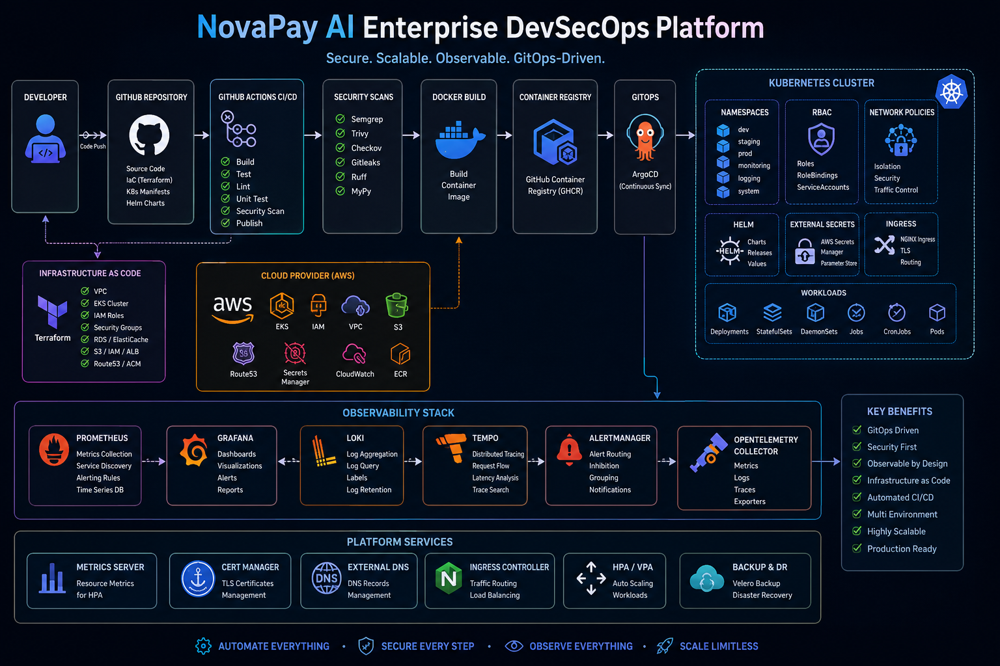

# 🚀 NovaPay AI Enterprise DevSecOps Platform



> Enterprise-grade DevSecOps Platform built using **Terraform**, **Kubernetes**, **Helm**, **ArgoCD**, **GitHub Actions**, **Prometheus**, **Grafana**, **Loki**, **Tempo**, **OpenTelemetry**, and **DevSecOps best practices**.

---

# 📖 Overview

NovaPay AI is a production-ready Enterprise DevSecOps Platform designed to automate the complete software delivery lifecycle.

The project follows GitOps principles and Infrastructure as Code to deploy secure, observable and scalable cloud-native applications.

---

# ✨ Features

## Infrastructure

- Terraform Infrastructure as Code
- Modular AWS Architecture
- IAM
- Networking
- Remote State
- Validation

---

## Kubernetes Platform

- Enterprise Namespaces
- RBAC
- Network Policies
- Resource Quotas
- LimitRanges
- Priority Classes
- Pod Security Admission

---

## GitOps

- ArgoCD
- App of Apps
- ApplicationSets
- Multi Cluster Deployment
- Sync Waves
- Sync Windows

---

## Helm

- Common Helm Library Chart
- Environment Values
- Reusable Templates
- OCI Ready

---

## CI/CD

- GitHub Actions
- Build Pipeline
- Release Pipeline
- Security Pipeline
- Validation Pipeline

---

## DevSecOps

- Semgrep
- Checkov
- Trivy
- Gitleaks
- Actionlint
- Yamllint
- OPA Policies

---

## Observability

- Prometheus
- Grafana
- Loki
- Tempo
- Alertmanager
- OpenTelemetry
- Node Exporter
- kube-state-metrics

---

# 🏗 Architecture


---

# 📂 Project Structure

```text
novapay-ai-devop
│
├── .github/
├── docs/
├── helm/
├── kubernetes/
├── scripts/
├── terraform/
├── lab/
├── README.md
│
├── GitHub Actions
├── Helm Charts
├── Kubernetes Platform
├── Terraform Modules
└── Documentation
```

---

# ⚙ Technology Stack

| Category | Technology |
|-----------|------------|
| Cloud | AWS |
| IaC | Terraform |
| Containers | Docker |
| Orchestration | Kubernetes |
| GitOps | ArgoCD |
| Package Manager | Helm |
| CI/CD | GitHub Actions |
| Monitoring | Prometheus |
| Dashboard | Grafana |
| Logs | Loki |
| Tracing | Tempo |
| Telemetry | OpenTelemetry |
| Security | Semgrep, Checkov, Trivy |

---

# 🔐 Security Features

- Least Privilege RBAC
- Network Policies
- Secret Scanning
- Dependency Scanning
- IaC Scanning
- Container Scanning
- Static Code Analysis
- Policy as Code

---

# 📊 Monitoring Stack

- Prometheus
- Grafana
- Alertmanager
- Loki
- Tempo
- OpenTelemetry Collector
- Node Exporter
- kube-state-metrics

---

# 🚀 CI/CD Pipeline

Developer

↓

GitHub Push

↓

GitHub Actions

↓

Security Scan

↓

Build

↓

Terraform Validation

↓

Helm Validation

↓

Kubernetes Validation

↓

ArgoCD GitOps

↓

Production Deployment

---

# 📦 Releases

| Version | Status |
|----------|--------|
| EPIC-05 | ✅ Kubernetes Foundation |
| EPIC-06 | ✅ Helm Platform |
| EPIC-07 | ✅ CI/CD Platform |
| EPIC-08 | ✅ Enterprise GitOps |
| EPIC-09 | ✅ Enterprise Observability |

---

# 📈 Roadmap

- Multi Cloud Support
- AI Operations
- Chaos Engineering
- Service Mesh
- Cost Optimization
- SRE Automation
- Security Dashboard
- Enterprise DR

---

# 👨‍💻 Author

**Arjun Rathod**

DevSecOps Engineer

GitHub:
https://github.com/Arjunrayhod

---

# ⭐ Support

If you like this project please give it a ⭐ on GitHub.

---

# 📜 License

MIT License
