# AegisAI Enterprise Autonomous DevSecOps Platform — System Architecture

**Document Version:** 1.0  
**Applies To:** AegisAI Platform Architecture  
**Status:** Approved — Technical Blueprint  
**Last Updated:** 2026-07-02  
**Document Owner:** Chief Enterprise Architect  
**Governing Document:** PROJECT_CONTEXT.md v1.0

---

## Table of Contents

1. Executive Summary
2. Architecture Goals
3. System Context Diagram
4. High-Level Architecture
5. Container Architecture
6. Component Architecture
7. Repository Dependency Graph
8. Data Flow
9. Control Flow
10. Security Boundaries
11. AI Multi-Agent Architecture
12. Platform Services
13. Deployment Architecture
14. Technology Interaction Matrix
15. Architecture Decision Summary
16. Risks
17. Future Evolution

---

## 1. Executive Summary

The AegisAI platform is an enterprise internal developer platform (IDP) architected as a layered system with strict dependency direction: Workload Layer → Platform Service Layer → Infrastructure Layer. The platform codifies CI/CD, DevSecOps, GitOps, Kubernetes, disaster recovery, FinOps, observability, compliance automation, and AI-assisted services into a cohesive, reusable reference architecture deployed on Amazon Web Services.

The architecture follows a zero-trust security model with policy-as-code enforcement, observability-by-default instrumentation, and cost-awareness at every layer. AI capabilities are designed as assistive platform services — they augment human decision-making through code review assistance, anomaly detection, incident triage, and natural language query interfaces. All AI services follow a consistent integration pattern: trigger, context collection, AI processing, result validation, action, and feedback loop.

The platform is organized into four engineering domains, each producing platform capabilities demonstrated by a reference workload: NovaPay (CI/CD), PaySecure (disaster recovery), LendFlow (FinOps), and FinServ (Kubernetes platform). The platform and workloads are deployed across multiple environments (development, staging, production) with GitOps-driven configuration management through ArgoCD.

All infrastructure is managed as code through Terraform. All security, compliance, and cost policies are expressed as machine-readable code enforced at pipeline time (CI/CD gates) and at runtime (OPA/Gatekeeper, Falco). Observability is provided by a Prometheus/Grafana metrics stack, structured logging pipeline, and distributed tracing, all instrumented by default for every workload.

---

## 2. Architecture Goals

### 2.1 Scalability

- The platform must support horizontal scaling of Kubernetes worker nodes, application pods (HPA, KEDA), and platform services independently.
- The control plane (ArgoCD, OPA, Prometheus) must scale independently of the data plane (application workloads).
- Multi-tenant isolation: one workload's scaling behavior must not impact another workload's availability or performance.
- Target: support 50+ workload teams, 500+ microservices, 50+ clusters across multiple regions.

### 2.2 Reliability

- All platform components and workloads must be deployed across multiple Availability Zones within a region.
- Critical workloads must support multi-region deployment with automated failover.
- Platform SLAs: ArgoCD < 60s sync latency, GitOps reconciliation < 120s, alert delivery < 60s.
- Error budgets govern deployment velocity. Deployment is blocked when error budget is exhausted.
- Chaos engineering experiments validate resilience continuously, not annually.

### 2.3 Security

- Zero trust architecture: no implicit trust, least privilege, micro-segmentation, continuous validation.
- Defense in depth across six layers: application, container, Kubernetes, infrastructure, identity, data.
- Policy-as-code enforced at admission time (OPA/Gatekeeper) and at pipeline time (CI/CD gates).
- Secrets are never stored in source code, configuration files, or container images. They are injected at runtime from AWS Secrets Manager or HashiCorp Vault with automatic rotation.
- Every action is authenticated, authorized, and audited.

### 2.4 Compliance

- Compliance is a platform property, not a workload-team responsibility.
- Controls mapping and evidence collection for PCI-DSS v4, SOC 2 Type II, RBI Master Directions on IT Governance, and ISO 27001.
- Policy-as-code validates infrastructure and configuration against compliance requirements before deployment.
- Automated evidence export for audit requests.

### 2.5 Maintainability

- Repository structure follows a consistent pattern across all workloads: `base/` shared configuration, `overlays/` environment-specific overrides, `policies/` OPA rules.
- Backward compatibility is maintained within a major version. Breaking changes require a major version bump and documented migration path.
- All architectural decisions are documented as Architecture Decision Records (ADRs).
- Technologies are evaluated against defined criteria before adoption. Deprecated technologies have a minimum 6-month notice period with automated migration paths.

### 2.6 Developer Experience

- Self-service environment provisioning through the developer portal, not through tickets.
- API-first design: all platform capabilities are exposed through GitOps repositories, REST APIs, CLI tools, and the developer portal UI.
- Golden paths for common workload types (web service with database, event processor, batch job, internal API) reduce cognitive load.
- Templates for projects, pipelines, and Kubernetes manifests accelerate onboarding.

### 2.7 Cost Optimization

- Every resource has an owner and a cost allocation tag enforced by policy.
- Budgets are enforced at the namespace, environment, and workload level.
- Usage analytics dashboards provide visibility into spending patterns.
- Automated anomaly detection alerts on unexpected cost spikes.
- Right-sizing recommendations are generated and surfaced through the developer portal.

### 2.8 Extensibility

- New platform capabilities are added through the platform service layer without modifying the infrastructure layer.
- Workload teams can opt out of golden paths with documented justification and architecture review.
- The technology stack supports primary and alternative choices (e.g., ArgoCD or Flux, CloudWatch or Loki, X-Ray or Jaeger).
- AI capabilities follow a consistent integration pattern, making it straightforward to add new AI services.

---

## 3. System Context Diagram

The following C4 context diagram shows all external actors and systems that interact with the AegisAI platform.

```mermaid
C4Context
    title System Context Diagram — AegisAI Platform

    Person(developer, "Developer", "Workload team engineer")
    Person(sec_eng, "Security Engineer", "Security team member")
    Person(platform_eng, "Platform Engineer", "Platform operations team")
    Person(exec, "Executive", "Leadership dashboard viewer")

    System_Boundary(aegisai, "AegisAI Platform") {
        System(dev_portal, "Developer Portal", "Self-service UI, CLI, API")
        System(ci_cd, "CI/CD Pipeline", "GitHub Actions with security gates")
        System(gitops, "GitOps Operator", "ArgoCD — desired state reconciliation")
        System(k8s, "Kubernetes Platform", "EKS with Istio, OPA, Falco, KEDA")
        System(ai_platform, "AI Platform", "Assistive AI services")
        System(obs_stack, "Observability Stack", "Prometheus, Grafana, Loki, X-Ray")
        System(sec_stack, "Security Stack", "OPA, Falco, SAST/SCA, Secrets Scanning")
        System(finops, "FinOps Engine", "Cost allocation, budgets, anomaly detection")
        System(compliance, "Compliance Engine", "Control mapping, evidence collection")
    }

    System_Ext(github, "GitHub", "Source control, PR management")
    System_Ext(gh_actions, "GitHub Actions", "CI/CD execution")
    System_Ext(ecr, "Amazon ECR", "Container image registry")
    System_Ext(aws, "Amazon Web Services", "Cloud infrastructure")
    System_Ext(bedrock, "AWS Bedrock", "AI/ML foundation models")
    System_Ext(slack, "Slack / PagerDuty", "Notification and incident management")
    System_Ext(sso, "Corporate SSO", "Identity provider (OIDC)")

    Rel(developer, github, "Pushes code, creates PRs")
    Rel(github, gh_actions, "Triggers workflows")
    Rel(gh_actions, ecr, "Pushes container images")
    Rel(developer, dev_portal, "Provisions environments, views dashboards")
    Rel(developer, ci_cd, "Views pipeline status")
    Rel(developer, gitops, "Reviews sync status")
    Rel(gitops, k8s, "Reconciles desired state")
    Rel(k8s, aws, "Provisions cloud resources")
    Rel(ci_cd, sec_stack, "Executes security scans")
    Rel(sec_stack, k8s, "Enforces policies at runtime")
    Rel(ai_platform, obs_stack, "Analyzes metrics, logs, traces")
    Rel(ai_platform, bedrock, "Invokes AI models")
    Rel(obs_stack, slack, "Sends alerts")
    Rel(sec_eng, sec_stack, "Configures policies")
    Rel(platform_eng, k8s, "Operates clusters")
    Rel(platform_eng, gitops, "Configures sync policies")
    Rel(exec, obs_stack, "Views executive dashboards")
    Rel(developer, sso, "Authenticates")
    Rel(sso, aegisai, "Provides identity tokens")
    Rel(compliance, aws, "Collects audit evidence")
```

**External Actors:**

| Actor | Description | Interactions |
|---|---|---|
| **Developer** | Workload team engineer | Pushes code, creates PRs, provisions environments, views dashboards |
| **Security Engineer** | Central security team member | Defines OPA policies, reviews scan results, audits compliance |
| **Platform Engineer** | Platform operations team | Operates clusters, manages GitOps, maintains platform SLAs |
| **Executive** | Leadership stakeholder | Views cost dashboards, compliance reports, SLO adherence |

**External Systems:**

| System | Purpose | Integration |
|---|---|---|
| **GitHub** | Source control, pull request management | Webhooks to GitHub Actions |
| **GitHub Actions** | CI/CD pipeline execution | Workflow definitions in repository |
| **Amazon ECR** | Container image storage | Push from CI, pull from EKS |
| **AWS** | Cloud infrastructure (EKS, DynamoDB, S3, Route53, KMS) | Terraform provisioning |
| **AWS Bedrock** | AI/LLM model inference | AI Platform API calls |
| **Slack / PagerDuty** | Notifications and incident management | Alertmanager webhooks |
| **Corporate SSO** | Identity provider | OIDC federation for all platform components |

---

## 4. High-Level Architecture

The AegisAI platform is organized into six horizontal layers. Each layer has a distinct responsibility, owns specific components, and depends only on the layers below it.

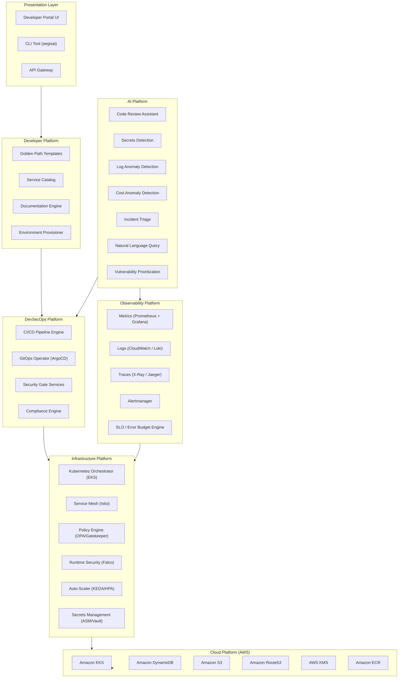

### 4.1 Presentation Layer

The outermost layer providing human and machine interfaces to the platform. All access passes through authentication (corporate SSO via OIDC) and authorization (RBAC).

- **Developer Portal UI:** Web-based self-service interface for environment provisioning, deployment tracking, cost dashboards, compliance reports, and runbook access.
- **CLI Tool (`aegisai`):** Command-line interface for developers who prefer terminal workflows. Supports environment provisioning, log tailing, port forwarding, and status queries.
- **API Gateway:** Central entry point for all REST API calls. Routes requests to the appropriate platform service. Handles authentication, rate limiting, and request validation.

### 4.2 Developer Platform

Provides the abstraction layer that workload teams interact with daily.

- **Golden Path Templates:** Pre-configured project scaffolding, pipeline definitions, and Kubernetes manifests for common workload types (web service, event processor, batch job, internal API).
- **Service Catalog:** Searchable registry of all platform services, APIs, and their documentation.
- **Documentation Engine:** Rendered ADRs, runbooks, API references, and troubleshooting guides.
- **Environment Provisioner:** Automated creation of namespaces, service accounts, IAM roles, and monitoring configuration for new environments.

### 4.3 AI Platform

Provides assistive AI services that augment human decision-making. Follows the AI Integration Pattern defined in PROJECT_CONTEXT.md Section 12: trigger, context collection, AI processing, result validation, action, feedback loop.

- **Code Review Assistant:** LLM-based analysis of pull requests for security vulnerabilities, compliance violations, and code quality issues.
- **Secrets Detection:** Regex pattern matching and ML classification for credential detection in code and configuration.
- **Log Anomaly Detection:** Statistical baseline modeling and ML classification for detecting operational anomalies in log streams.
- **Cost Anomaly Detection:** Time-series forecasting with threshold-based alerting for unexpected cost spikes.
- **Incident Triage:** LLM-based analysis of incident context, historical runbooks, and similar incidents to suggest remediation actions.
- **Natural Language Query:** LLM-based translation of natural language questions into observability platform queries.
- **Vulnerability Prioritization:** ML-based severity assessment incorporating CVSS score, exploit availability, and asset criticality.

### 4.4 DevSecOps Platform

The control plane for all CI/CD, GitOps, security, and compliance automation.

- **CI/CD Pipeline Engine:** Standardized GitHub Actions workflows with 8 security gates: code quality, SAST, SCA, secrets detection, container scanning, IaC scanning, policy validation, and approval.
- **GitOps Operator (ArgoCD):** Continuous reconciliation of desired state from Git repositories to Kubernetes clusters. Drift detection, automated remediation, health check-based rollback.
- **Security Gate Services:** Orchestration of all security scanning tools (Semgrep, CodeQL, Trivy, Checkov, tfsec) within the CI/CD pipeline.
- **Compliance Engine:** Automated control mapping, evidence collection, and policy validation for PCI-DSS, SOC 2, RBI, and ISO 27001 frameworks.

### 4.5 Infrastructure Platform

The runtime environment where workloads are deployed and operated.

- **Kubernetes Orchestrator (EKS):** Managed Kubernetes control plane with private endpoint, KMS encryption, and cluster autoscaling.
- **Service Mesh (Istio):** mTLS, traffic management, observability, and authorization policies at the service-to-service level.
- **Policy Engine (OPA/Gatekeeper):** Admission webhook that validates all Kubernetes resources against defined policies before they are created or modified.
- **Runtime Security (Falco):** Kernel-level runtime security monitoring with real-time alerting on anomalous system calls.
- **Auto-Scaler (KEDA/HPA):** Event-driven and metric-based horizontal pod autoscaling.
- **Secrets Management (AWS Secrets Manager / Vault):** Secure storage, rotation, and runtime injection of secrets.

### 4.6 Observability Platform

Collects, stores, and visualizes telemetry data from all platform components and workloads.

- **Metrics (Prometheus + Grafana):** Time-series metrics collection with pre-configured dashboards for every workload.
- **Logs (CloudWatch / Loki):** Structured logging pipeline with centralized aggregation and search.
- **Traces (X-Ray / Jaeger):** Distributed tracing across service boundaries with latency breakdown.
- **Alertmanager:** Alert routing, deduplication, and notification delivery to Slack, PagerDuty, and email.
- **SLO / Error Budget Engine:** Tracks service level objectives and calculates error budget consumption.

### 4.7 Cloud Platform

The underlying cloud infrastructure provisioned and managed through Terraform. All resources are defined as code with policy validation before deployment.

---

## 5. Container Architecture

The following containers (services/processes) comprise the AegisAI platform. Each container is deployed as one or more Kubernetes pods.

### 5.1 Platform Service Containers

| Container | Responsibility | Dependencies | Communication |
|---|---|---|---|
| **developer-portal** | Web UI for self-service platform operations | API Gateway, SSO, Environment Provisioner | HTTPS (REST) |
| **api-gateway** | Authentication, rate limiting, request routing | SSO (OIDC), all platform services | HTTPS (REST/gRPC) |
| **env-provisioner** | Automated namespace, IAM, monitoring setup | Terraform Operator, ArgoCD | gRPC |
| **pipeline-orchestrator** | Coordinates CI/CD security gates | GitHub Actions, Security Scanners | HTTPS (webhooks) |
| **security-gate-orchestrator** | Runs SAST, SCA, IaC scans in sequence | Semgrep, CodeQL, Trivy, Checkov, tfsec | Local exec |
| **compliance-engine** | Control mapping, evidence collection, policy validation | AWS CloudTrail, Config, K8s Audit Log | HTTPS (REST) |
| **finops-engine** | Cost allocation, budget enforcement, anomaly detection | AWS Cost Explorer, SNS, Budgets API | HTTPS (REST) |
| **ai-orchestrator** | Routes AI requests to appropriate AI service | AWS Bedrock, SageMaker | HTTPS (REST) |
| **code-review-ai** | LLM-based PR analysis | ai-orchestrator, GitHub API | HTTPS (REST) |
| **anomaly-detector** | Log and metric anomaly detection | Prometheus, Loki | gRPC streaming |
| **incident-triage-ai** | Incident context analysis and remediation suggestions | PagerDuty API, Runbook DB | HTTPS (REST) |
| **nl-query-engine** | Natural language to observability query translation | Prometheus API, Loki API | HTTPS (REST) |
| **slo-engine** | SLO computation, error budget tracking | Prometheus, Grafana API | gRPC |

### 5.2 Infrastructure Containers

| Container | Responsibility | Dependencies | Communication |
|---|---|---|---|
| **argo-cd** | GitOps reconciliation, drift detection, sync | Kubernetes API, Git repositories | HTTPS, gRPC |
| **istiod** | Service mesh control plane | Kubernetes API | gRPC |
| **gatekeeper-audit** | OPA constraint audit (periodic) | Kubernetes API | HTTPS |
| **gatekeeper-webhook** | OPA admission validation | Kubernetes API (admission) | HTTPS (webhook) |
| **falco** | Runtime security monitoring | Kernel (eBPF) | gRPC (events) |
| **keda-operator** | Event-driven autoscaling | Kubernetes API, event sources | HTTPS |
| **prometheus-server** | Metrics collection and storage | All workloads (scrape endpoints) | HTTPS (scrape) |
| **grafana** | Metrics visualization and dashboards | Prometheus, Loki | HTTPS (datasource) |
| **loki** | Log aggregation and query | All workloads (log push) | gRPC (push) |
| **alertmanager** | Alert routing and notification | Prometheus | gRPC |
| **external-secrets** | Secrets synchronization from ASM/Vault to K8s Secrets | AWS Secrets Manager, HashiCorp Vault | HTTPS (API) |

### 5.3 Container Communication Patterns

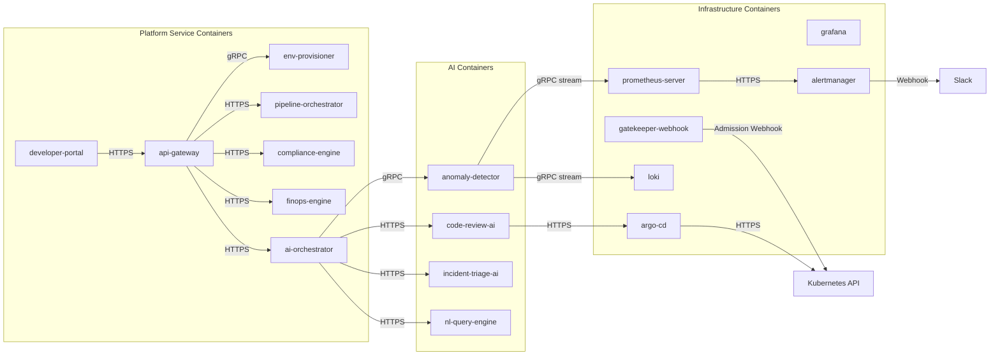

---

## 6. Component Architecture

Each container is decomposed into components. The following breakdown covers all major platform containers.

### 6.1 API Gateway

```
api-gateway
├── AuthN Handler       — OIDC token validation, session management
├── AuthZ Handler       — RBAC policy evaluation
├── Rate Limiter        — Per-tenant and per-endpoint rate limiting
├── Request Router      — Path-based routing to platform services
├── Request Validator   — Input schema validation (JSON Schema)
└── Audit Logger        — Request/response logging to audit trail
```

### 6.2 CI/CD Pipeline Orchestrator

```
pipeline-orchestrator
├── Webhook Receiver      — GitHub webhook ingestion
├── Pipeline Builder      — Dynamic pipeline generation from templates
├── Gate Coordinator      — Sequential gate execution with pass/fail logic
│   ├── Code Quality Gate    — Linter execution
│   ├── SAST Gate            — Semgrep / CodeQL execution
│   ├── SCA Gate             — Dependency vulnerability scan
│   ├── Secrets Gate         — Secrets detection scan
│   ├── Container Scan Gate  — Trivy image scan
│   ├── IaC Scan Gate        — Checkov / tfsec execution
│   └── Policy Gate          — OPA policy evaluation
├── Approval Manager      — Manual approval workflow (change risk classification)
└── Artifact Publisher    — Image push to ECR, attestation generation
```

### 6.3 AI Orchestrator

```
ai-orchestrator
├── Request Classifier     — Determines which AI capability to invoke
├── Context Collector      — Gathers relevant data from platform services
├── Model Router           — Routes to Bedrock model or SageMaker endpoint
├── Result Validator       — Validates AI output against constraints and policies
├── Action Executor        — Executes action (comment on PR, create ticket, etc.)
└── Feedback Collector     — Captures human feedback for model improvement
```

### 6.4 Compliance Engine

```
compliance-engine
├── Control Mapper           — Maps platform controls to compliance framework requirements
├── Evidence Collector       — Gathers evidence from CloudTrail, Config, K8s Audit, pipeline logs
├── Policy Validator         — Validates configuration against control definitions
├── Report Generator         — Generates compliance reports per framework
└── Remediation Tracker      — Tracks control deficiencies and remediation status
```

### 6.5 FinOps Engine

```
finops-engine
├── Cost Data Ingestion       — CUR import, Cost Explorer API polling
├── Tag Enforcer              — Validates cost allocation tags on all resources
├── Budget Controller         — Budget definition, threshold monitoring, notification
├── Anomaly Detector          — Time-series forecasting and anomaly identification
├── Right-Sizing Recommender  — Resource utilization analysis with recommendations
└── Dashboard API             — Cost data exposure for Grafana dashboards
```

---

## 7. Repository Dependency Graph

The repository follows a dependency hierarchy where changes in lower layers may require updates in upper layers.

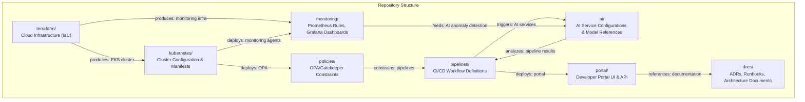

### Dependency Rules

1. `terraform/` has no internal dependency — it is the foundation. It may reference outputs from cloud provider state.
2. `kubernetes/` depends on `terraform/` for cluster existence. It may define workload deployments, platform services, and add-on configurations.
3. `policies/` depends on `kubernetes/` for OPA/Gatekeeper deployment. Policy constraints reference Kubernetes resource kinds.
4. `pipelines/` depends on `kubernetes/` (deployment target) and `terraform/` (infrastructure target). Pipeline templates reference cluster names and Terraform workspaces.
5. `monitoring/` depends on `kubernetes/` for Prometheus and Grafana deployment. Dashboard definitions reference workload names.
6. `ai/` depends on `monitoring/` (data sources for anomaly detection) and `pipelines/` (code review triggers).
7. `portal/` depends on `kubernetes/` (deployment target) and `docs/` (content).

---

## 8. Data Flow

The end-to-end data flow from a developer committing code to an executive viewing a dashboard.

### 8.1 Deployment Data Flow

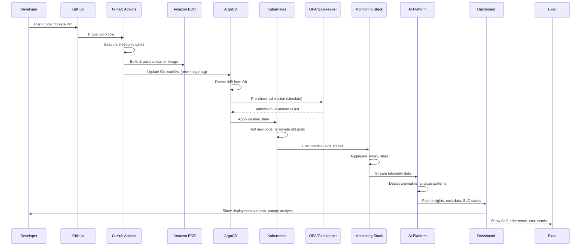

### 8.2 AI-Assisted Code Review Data Flow

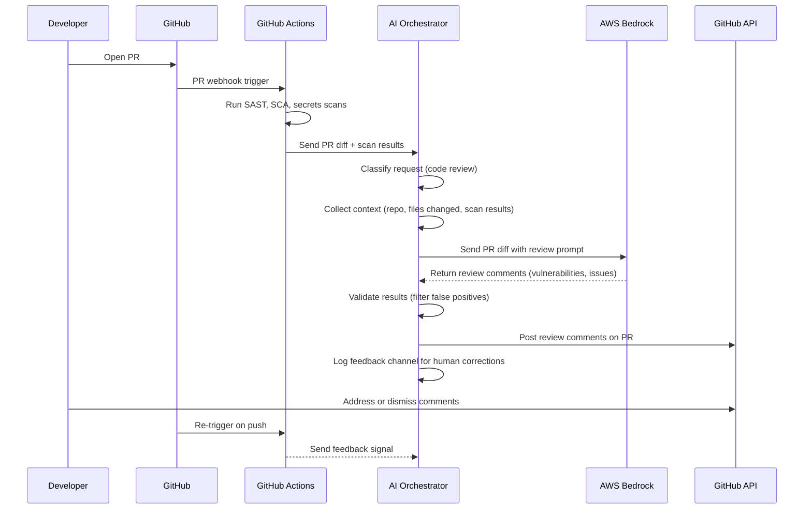

---

## 9. Control Flow

### 9.1 Deployment Decision Flow

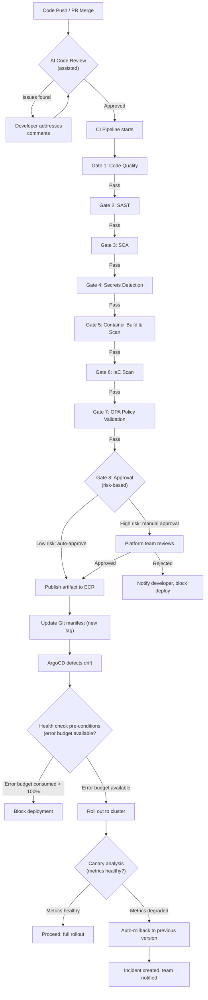

### 9.2 AI Decision Flow

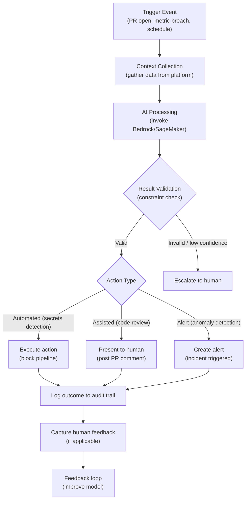

### 9.3 Rollback Flow

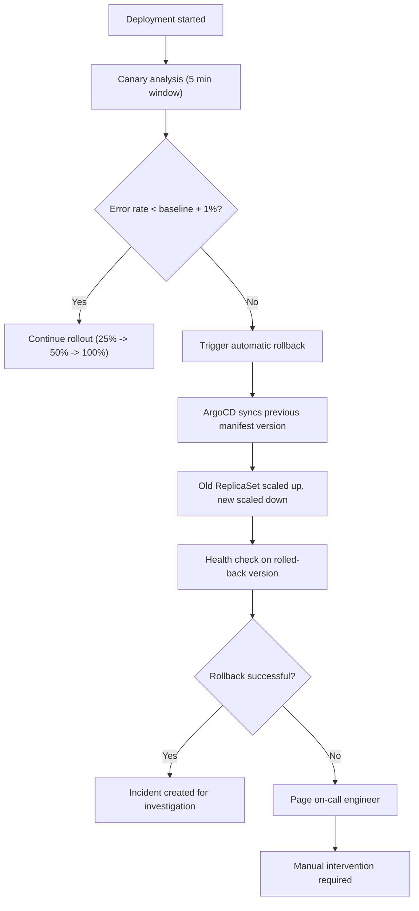

---

## 10. Security Boundaries

### 10.1 Trust Zones

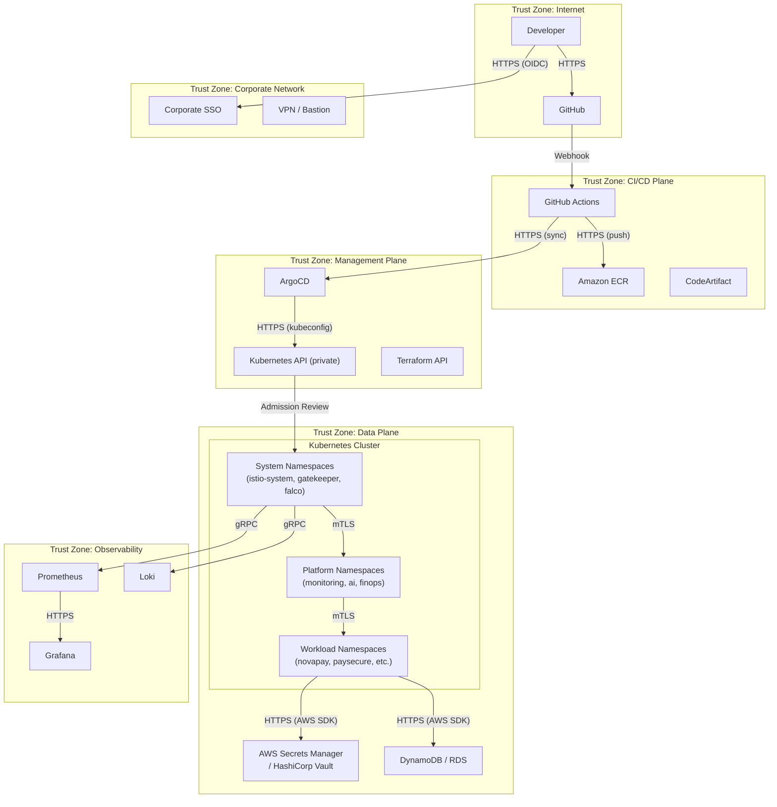

### 10.2 Boundary Controls

| Boundary | From | To | Controls |
|---|---|---|---|
| **Internet → Corporate Network** | Public internet | Corporate VPN/SSO | WAF, DDoS protection (AWS Shield), OIDC authentication |
| **Corporate Network → CI/CD Plane** | Developer workstation | GitHub Actions | Signed commits, branch protection, PR requirements |
| **CI/CD Plane → Management Plane** | GitHub Actions | ArgoCD, K8s API | OIDC-based IRSA, short-lived tokens, IP allow-listing |
| **Management Plane → Cluster** | ArgoCD | Kubernetes API | mTLS, RBAC, audit logging, admission webhooks |
| **Cluster Internal** | Namespace to namespace | Cross-namespace traffic | Istio authorization policies, NetworkPolicies (default deny) |
| **Data Plane → Secrets** | Pod | AWS Secrets Manager | IAM roles for service accounts (IRSA), VPC endpoints |
| **Data Plane → Database** | Pod | DynamoDB / RDS | IAM authentication, TLS 1.3, VPC endpoints, encryption at rest |
| **Cluster → Observability** | Prometheus, Loki | Grafana | mTLS, RBAC, admin authentication (SSO) |

### 10.3 Security Perimeter Diagram

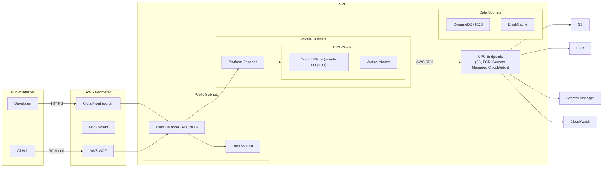

---

## 11. AI Multi-Agent Architecture

The AI Platform consists of seven AI capabilities, each implemented as a service that follows the AI Integration Pattern defined in PROJECT_CONTEXT.md Section 12. These are referred to as "AI Services" consistent with the source of truth — they are assistive, constrained, auditable, and testable.

### 11.1 Code Review Assistant

| Attribute | Description |
|---|---|
| **Purpose** | Analyze pull requests for security vulnerabilities, compliance violations, and code quality issues |
| **Inputs** | PR diff, changed files list, repository metadata, SAST/SCA scan results |
| **Outputs** | Review comments with severity, category, file location, and suggested fix |
| **Provider** | AWS Bedrock (LLM) |
| **Trigger** | GitHub PR opened or synchronized webhook |
| **Dependencies** | GitHub API, SAST scanner results, repository language configuration |
| **Communication** | REST API to AI Orchestrator → Bedrock; REST API to GitHub for comment posting |
| **Failure Handling** | If AI service is unavailable, PR review is skipped and developer is notified that AI review was not performed. The PR is not blocked. |
| **Human Approval** | Required for all security-related comments. Developer must acknowledge or dismiss before merge. |
| **Feedback Loop** | Developer can dismiss comments with a reason. Dismissal signals are logged for model improvement. |

### 11.2 Secrets Detection

| Attribute | Description |
|---|---|
| **Purpose** | Detect hardcoded credentials, API keys, tokens, and other secrets in code and configuration files |
| **Inputs** | File contents from PR diff, full repository scan on schedule |
| **Outputs** | Detection alert with file, line number, secret type, and severity |
| **Provider** | Regex patterns + ML classification (self-hosted or Bedrock) |
| **Trigger** | CI/CD pipeline gate (every commit), scheduled full-repository scan |
| **Dependencies** | Pipeline orchestrator, repository clone |
| **Communication** | Local file access within CI/CD runner |
| **Failure Handling** | If scanner fails to execute, pipeline blocks with "scan inconclusive" — human must verify |
| **Human Approval** | Not required for blocking action. Positive detection blocks the pipeline automatically. |
| **Feedback Loop** | False positive reports are used to tune regex patterns and ML model thresholds |

### 11.3 Log Anomaly Detection

| Attribute | Description |
|---|---|
| **Purpose** | Detect operational anomalies in application and platform log streams |
| **Inputs** | Structured log streams from Loki or CloudWatch Logs |
| **Outputs** | Anomaly alert with severity, log excerpt, time window, and affected service |
| **Provider** | Statistical baseline modeling + ML classification (SageMaker) |
| **Trigger** | Continuous streaming (real-time), baseline recomputation (daily) |
| **Dependencies** | Loki/CloudWatch Logs, Prometheus (for metric correlation) |
| **Communication** | gRPC stream from log source to anomaly detector |
| **Failure Handling** | If anomaly detector is down, logs continue to be collected and stored. Detection resumes when service is restored. Baseline model is preserved. |
| **Human Approval** | Required before automated remediation action. Alert creates a PagerDuty incident for human investigation. |
| **Feedback Loop** | Human confirmation or dismissal of anomaly alerts is captured as training signal |

### 11.4 Cost Anomaly Detection

| Attribute | Description |
|---|---|
| **Purpose** | Detect unexpected cloud cost spikes and spending pattern changes |
| **Inputs** | AWS Cost and Usage Reports, Cost Explorer API data, resource tag metadata |
| **Outputs** | Cost anomaly alert with estimated overage, affected resources, and account |
| **Provider** | Time-series forecasting (Prophet/ARIMA) + threshold-based alerting |
| **Trigger** | Daily forecast computation, real-time cost ingestion |
| **Dependencies** | AWS Cost Explorer API, AWS Budgets API, tag database |
| **Communication** | REST API to FinOps Engine → Cost Anomaly service |
| **Failure Handling** | If forecast model fails, threshold-based alerts remain active. Forecast resumes on next schedule. |
| **Human Approval** | Required for automated remediation (e.g., stopping a non-production instance). Alert-only for anomalies. |
| **Feedback Loop** | Confirmed anomalies are added to training data. False positives adjust threshold sensitivity. |

### 11.5 Incident Triage

| Attribute | Description |
|---|---|
| **Purpose** | Analyze incident context and suggest remediation actions based on historical runbooks and similar incidents |
| **Inputs** | Incident alert payload, service metadata, historical runbooks, similar incident database |
| **Outputs** | Suggested remediation steps, relevant runbook links, similar incident references, probable root cause |
| **Provider** | AWS Bedrock (LLM) |
| **Trigger** | PagerDuty incident creation webhook |
| **Dependencies** | PagerDuty API, Runbook database, Incident history database |
| **Communication** | REST API to AI Orchestrator → Bedrock |
| **Failure Handling** | If triage AI is unavailable, incident is routed to on-call engineer without AI augmentation. Standard runbooks apply. |
| **Human Approval** | Required for all suggested actions. AI recommendations are presented as suggestions, not executed automatically. |
| **Feedback Loop** | On-call engineer rates suggestion helpfulness. Accepted suggestions reinforce the model. Rejected suggestions trigger review. |

### 11.6 Natural Language Query

| Attribute | Description |
|---|---|
| **Purpose** | Translate natural language questions into observability platform queries |
| **Inputs** | Natural language question (text), target platform context (metrics, logs, traces available) |
| **Outputs** | Generated query (PromQL, LogQL), executed result, human-readable response |
| **Provider** | AWS Bedrock (LLM) |
| **Trigger** | User submits question through developer portal or CLI |
| **Dependencies** | Prometheus API, Loki API, query schema definitions |
| **Communication** | REST API to AI Orchestrator → NLQ service → observability APIs |
| **Failure Handling** | If NLQ service is unavailable, the UI displays a "try again" message with manual query interface fallback. |
| **Human Approval** | Not required. Query results are presented directly with a confidence score. User can modify the generated query. |
| **Feedback Loop** | User ratings on query quality are collected. Rejected queries are logged for model improvement. |

### 11.7 Vulnerability Prioritization

| Attribute | Description |
|---|---|
| **Purpose** | Prioritize security vulnerabilities based on CVSS score, exploit availability, asset criticality, and environmental factors |
| **Inputs** | Vulnerability scan results, SBOM, asset inventory with criticality labels, exploit intelligence feeds |
| **Outputs** | Prioritized vulnerability list with recommended patch window per severity |
| **Provider** | ML classification model (SageMaker) |
| **Trigger** | On-demand (after container or dependency scan), scheduled recalculations |
| **Dependencies** | Trivy scanner, SCA scanner, asset database, NVD/CVE feeds |
| **Communication** | REST API to AI Orchestrator → prioritization service |
| **Failure Handling** | If AI prioritization fails, vulnerabilities are presented sorted by CVSS score only (standard prioritization). |
| **Human Approval** | Required for patch window changes. Prioritization list is advisory — security team makes final remediation decisions. |
| **Feedback Loop** | Security team's patch priority decisions are captured and used to refine the prioritization model |

### 11.8 AI Integration Pattern (All Services)

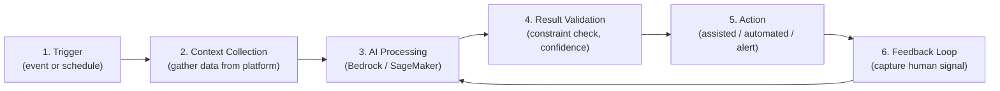

---

## 12. Platform Services

### 12.1 Terraform

| Attribute | Description |
|---|---|
| **Purpose** | Provision and manage all cloud infrastructure as code |
| **Provider** | HashiCorp Terraform (>= 1.9) with AWS provider |
| **State Management** | S3 backend with DynamoDB locking |
| **Module Structure** | `modules/` directory with reusable modules: `vpc`, `eks`, `dynamodb`, `s3`, `iam`, `kms`, `route53` |
| **Environment Separation** | `environments/dev/`, `environments/staging/`, `environments/prod/` with shared `modules/` |
| **Policy Validation** | Checkov and tfsec run in CI/CD pipeline before apply |
| **Execution** | GitHub Actions workflow with plan/apply stages. Manual approval required for production. |

### 12.2 GitOps (ArgoCD)

| Attribute | Description |
|---|---|
| **Purpose** | Continuous reconciliation of desired state from Git repositories to Kubernetes clusters |
| **Deployment** | Installed in `argocd` namespace via Helm chart |
| **Repository Structure** | App-of-apps pattern: root Application manages child Applications per workload/environment |
| **Sync Policy** | Automated sync with self-healing. Manual sync for production. |
| **Health Checks** | Custom health checks for each workload type. Failed health = automatic rollback. |
| **Drift Detection** | 3-minute reconciliation interval. Drift alerts sent to Slack. |
| **Image Updates** | Image Updater (or Renovate) monitors ECR for new image tags and updates Git manifests |

### 12.3 Kubernetes (EKS)

| Attribute | Description |
|---|---|
| **Purpose** | Container orchestration for all platform services and workloads |
| **Version** | EKS 1.30+ |
| **Node Groups** | Multiple node groups: system (platform components), general (workloads), spot (cost-optimized, non-critical) |
| **Cluster Autoscaler** | Karpenter for node-level scaling |
| **Pod Autoscaling** | HPA (metric-based) + KEDA (event-driven) |
| **Network** | Amazon VPC CNI with Calico or Cilium for NetworkPolicies |
| **Add-ons** | VPC CNI, CoreDNS, kube-proxy, AWS EBS CSI driver, AWS EFS CSI driver |
| **Backup** | Velero for cluster resource backup and restore |

### 12.4 Observability

| Attribute | Description |
|---|---|
| **Metrics** | Prometheus with kube-prometheus-stack Helm chart. ServiceMonitor CRDs for workload scraping. |
| **Dashboards** | Grafana with pre-configured dashboards per workload type. SLO dashboards with error budget tracking. |
| **Logs** | Structured JSON logging via Fluent Bit DaemonSet → CloudWatch or Loki. Log retention policies per environment. |
| **Traces** | OpenTelemetry SDK instrumentation → AWS X-Ray or Jaeger. Trace sampling rate: 10% (production), 100% (dev). |
| **Alerting** | PrometheusRule CRDs with severity-based routing. Alertmanager configured for Slack, PagerDuty, and email. |
| **SLO Management** | SLOs defined as Prometheus recording rules. Error budget calculated from SLO compliance. |

### 12.5 Security

| Attribute | Description |
|---|---|
| **SAST** | Semgrep (primary) with custom rules. CodeQL (secondary) for critical workloads. |
| **SCA** | Trivy (dependency scanning). SBOM generation in CycloneDX format. |
| **Secrets Scanning** | Custom scanner (AI-assisted) + pre-commit hooks (detect-secrets, git-secrets). |
| **Container Scanning** | Trivy in CI/CD pipeline. ECR scanning at rest. |
| **IaC Scanning** | Checkov (Terraform), tfsec (Terraform), OPA (Kubernetes). |
| **Runtime Security** | Falco with custom rules. Real-time alerting on anomalous syscalls. |
| **Policy Engine** | OPA/Gatekeeper with constraint templates for security, compliance, and cost policies. |

### 12.6 Compliance

| Attribute | Description |
|---|---|
| **Framework Coverage** | PCI-DSS v4, SOC 2 Type II, RBI Master Directions, ISO 27001 |
| **Control Mapping** | YAML-based control definitions mapping platform capabilities to framework requirements |
| **Evidence Collection** | Automated collection from CloudTrail, AWS Config, Kubernetes audit logs, CI/CD pipeline logs |
| **Policy Validation** | OPA policies that validate configuration against control requirements |
| **Reporting** | Scheduled compliance report generation. Evidence export for auditor requests. |

### 12.7 FinOps

| Attribute | Description |
|---|---|
| **Cost Allocation** | Mandatory resource tags: `workload`, `environment`, `owner`, `cost-center`. Enforced by OPA policy. |
| **Budget Controls** | AWS Budgets per workload and environment. Notifications at 50%, 80%, 95%, 100% thresholds. |
| **Usage Analytics** | Cost and Usage Reports (CUR) in S3, queried by Athena, visualized in Grafana. |
| **Anomaly Detection** | Time-series forecasting with automated alerts on cost spikes > 20% above forecast. |
| **Right-Sizing** | Compute Optimizer recommendations surfaced in developer portal. Automated rightsizing for non-production. |

### 12.8 Developer Portal

| Attribute | Description |
|---|---|
| **Environment Provisioning** | Self-service form requesting namespace, IAM role, monitoring configuration. Automated provisioning via GitOps PR. |
| **Service Catalog** | Searchable listing of all platform capabilities with documentation links and API references. |
| **Deployment Tracking** | Real-time view of ArgoCD sync status, pipeline execution, and canary analysis. |
| **Cost Dashboard** | Per-workload and per-environment cost breakdown with budget burn-down charts. |
| **Compliance Dashboard** | Control coverage percentage, evidence collection status, open findings. |
| **Runbook Access** | Searchable runbook library with Runbook Automation integration (Rundeck or similar). |

---

## 13. Deployment Architecture

### 13.1 Environment Topology

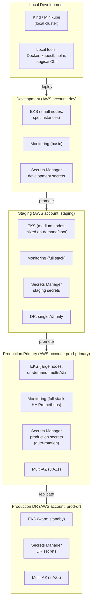

### 13.2 Environment Specifications

| Attribute | Local | Dev | Staging | Production Primary | Production DR |
|---|---|---|---|---|---|
| **AWS Account** | N/A | `dev` | `staging` | `prod-primary` | `prod-dr` |
| **Region** | N/A | ap-south-1 | ap-south-1 | ap-south-1 | ap-southeast-1 |
| **EKS Nodes** | 1 (simulated) | 2-3 (spot) | 5-10 (mixed) | 20-50 (on-demand) | 10-20 (on-demand) |
| **AZ Count** | 1 | 1 | 2 | 3 | 2 |
| **Secrets** | Local env vars | Dev ASM | Staging ASM | Prod ASM (auto-rotate) | DR ASM (replicated) |
| **Monitoring** | None | Basic | Full | Full + HA | Core |
| **Alerting** | None | Slack only | Slack + PagerDuty | Slack + PagerDuty + Email | PagerDuty |
| **Backup** | None | Daily | Daily | Hourly + Daily | Hourly |
| **DR Role** | N/A | N/A | N/A | Active | Warm Standby |
| **Deployment** | Manual | Automatic on PR merge | Automatic on tag | Manual approval + canary | Automated failover |

### 13.3 Disaster Recovery Architecture

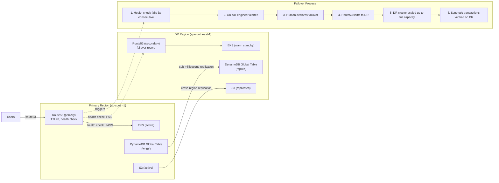

**DR Specifications:**
- **RTO Target:** 15 minutes (automated detection + human approval + DNS propagation)
- **RPO Target:** < 5 seconds (DynamoDB Global Tables synchronous replication per-region)
- **Failover Trigger:** Route53 health check failure (3 consecutive checks, 10-second interval)
- **Failover Type:** Human-in-the-loop (automated detection, human approval for production failover)
- **Failback:** Documented runbook, tested quarterly through chaos experiments

---

## 14. Technology Interaction Matrix

The following matrix shows which major technologies communicate with each other and the protocol used.

| Component A | Component B | Protocol | Direction | Purpose |
|---|---|---|---|---|
| **Developer Portal** | API Gateway | HTTPS (REST) | → | All UI requests |
| **CLI (aegisai)** | API Gateway | HTTPS (REST/gRPC) | → | CLI operations |
| **API Gateway** | All Platform Services | gRPC (internal) | → | Service routing |
| **API Gateway** | Corporate SSO | OIDC (HTTPS) | ↔ | Authentication |
| **GitHub** | GitHub Actions | Webhook (HTTPS) | → | Pipeline trigger |
| **GitHub Actions** | SAST Scanner | CLI execution | → | Static analysis |
| **GitHub Actions** | SCA Scanner | CLI execution | → | Dependency scan |
| **GitHub Actions** | Container Scanner | CLI execution | → | Image vulnerability scan |
| **GitHub Actions** | ECR | HTTPS (push) | → | Image upload |
| **GitHub Actions** | ArgoCD | HTTPS (Git push) | → | Manifest update |
| **ArgoCD** | Kubernetes API | HTTPS (kubeconfig) | → | Resource reconciliation |
| **ArgoCD** | Git Repositories | HTTPS (Git) | ↔ | Desired state |
| **Kubernetes API** | OPA/Gatekeeper | Admission Review (HTTPS) | → | Policy validation |
| **Kubernetes API** | KEDA | HTTPS (CRD watch) | ↔ | ScaledObject management |
| **Kubernetes API** | External Secrets | HTTPS (CRD watch) | ↔ | Secret synchronization |
| **Prometheus** | All workloads | HTTPS (scrape) | → | Metrics collection |
| **Fluent Bit** | CloudWatch / Loki | gRPC (push) | → | Log shipping |
| **OpenTelemetry** | X-Ray / Jaeger | gRPC (push) | → | Trace export |
| **Prometheus** | Alertmanager | gRPC | → | Alert firing |
| **Alertmanager** | Slack / PagerDuty | Webhook (HTTPS) | → | Notification |
| **AI Orchestrator** | AWS Bedrock | HTTPS (REST) | → | LLM inference |
| **AI Orchestrator** | Prometheus | HTTPS (REST) | → | Metric query (anomaly detection) |
| **AI Orchestrator** | Loki | gRPC | → | Log query (anomaly detection) |
| **AI Orchestrator** | GitHub API | HTTPS (REST) | → | PR comment posting |
| **FinOps Engine** | AWS Cost Explorer | HTTPS (AWS SDK) | → | Cost data |
| **FinOps Engine** | AWS Budgets | HTTPS (AWS SDK) | → | Budget management |
| **Compliance Engine** | AWS CloudTrail | HTTPS (AWS SDK) | → | Audit log query |
| **Compliance Engine** | AWS Config | HTTPS (AWS SDK) | → | Resource compliance |
| **Compliance Engine** | Kubernetes Audit | HTTPS (API) | → | Audit log collection |
| **Terraform** | AWS API | HTTPS (AWS SDK) | → | Infrastructure provisioning |
| **Terraform** | S3 (state) | HTTPS (AWS SDK) | → | State storage |
| **Terraform** | DynamoDB (lock) | HTTPS (AWS SDK) | → | State locking |
| **Developer Portal** | ArgoCD API | HTTPS (REST) | → | Sync status queries |
| **Developer Portal** | Grafana API | HTTPS (REST) | → | Dashboard embedding |

---

## 15. Architecture Decision Summary

The following table summarizes key architecture decisions. Detailed rationale for each decision is documented in individual Architecture Decision Records (ADRs) in the `docs/adr/` directory.

| ADR ID | Decision | Rationale | Status |
|---|---|---|---|
| **ADR-001** | AWS as primary cloud provider | Market maturity, service breadth, team expertise | Approved |
| **ADR-002** | Amazon EKS for container orchestration | Managed control plane, AWS integration, CNCF certified | Approved |
| **ADR-003** | Terraform for IaC | Broad provider support, mature ecosystem, team familiarity | Approved |
| **ADR-004** | S3 + DynamoDB for Terraform state | Remote state sharing, state locking, audit history | Approved |
| **ADR-005** | GitHub Actions for CI/CD | Repository co-location, ecosystem, Actions marketplace | Approved |
| **ADR-006** | ArgoCD for GitOps | Multi-cluster support, UI, RBAC, health checks | Approved |
| **ADR-007** | Istio for service mesh | Feature richness, Envoy ecosystem, observability | Approved |
| **ADR-008** | OPA / Gatekeeper for policy engine | Policy language expressiveness, CNCF graduated | Approved |
| **ADR-009** | Falco for runtime security | CNCF graduated, kernel-level visibility, custom rules | Approved |
| **ADR-010** | KEDA for event-driven autoscaling | Multi-trigger support, CNCF project | Approved |
| **ADR-011** | Prometheus + Grafana for metrics | CNCF graduated, ecosystem, community dashboards | Approved |
| **ADR-012** | Loki for log aggregation (secondary) vs CloudWatch (primary) | Native AWS integration (CloudWatch), cost-effective long-term retention (Loki) | Pending |
| **ADR-013** | AWS X-Ray for tracing (primary) vs Jaeger (secondary) | Native AWS, no additional infrastructure, IAM integration | Approved |
| **ADR-014** | AWS Secrets Manager for secrets (primary) vs Vault (secondary) | Native AWS integration, automatic rotation, IAM policies | Approved |
| **ADR-015** | AWS Bedrock for AI/ML model inference | Managed foundation models, data residency controls, IAM integration | Approved |
| **ADR-016** | Multi-account strategy: dev / staging / prod-primary / prod-dr | Blast radius containment, compliance isolation, cost separation | Approved |
| **ADR-017** | Blue-green deployment via ArgoCD + Istio traffic shifting | Zero-downtime, instant rollback, canary analysis | Approved |
| **ADR-018** | OpenTelemetry for instrumentation (vendor-neutral) | Avoid vendor lock-in, standard data format, broad language support | Approved |
| **ADR-019** | Admission webhooks (Gatekeeper) for policy enforcement | Prevent non-compliant resources before creation, audit mode for migration | Approved |
| **ADR-020** | IRSA (IAM Roles for Service Accounts) for pod identity | Short-lived credentials, no static keys, audit integration | Approved |

---

## 16. Risks

### 16.1 Architectural Risks

| Risk | Likelihood | Impact | Mitigation |
|---|---|---|---|
| **GitOps operator becomes bottleneck at scale** | Medium | High | Shard ArgoCD instances by cluster group. Use ApplicationSets for large-scale workload management. |
| **Cross-region DynamoDB replication latency exceeds RPO** | Low | High | Monitor replication lag as SLO. Failover gated by replication lag threshold. |
| **Istio control plane scales poorly with mesh size** | Medium | Medium | Use Istio revision-based upgrades. Configure sidecar scope to limit proxy configuration per namespace. |
| **OPA/Gatekeeper admission latency impacts deployment velocity** | Low | Medium | Use OPA's caching and partial evaluation. Set admission timeout with graceful fallback. |

### 16.2 Technical Risks

| Risk | Likelihood | Impact | Mitigation |
|---|---|---|---|
| **Terraform state drift due to out-of-band changes** | Medium | High | GitOps-style drift detection for Terraform. Periodic `terraform plan` in CI/CD. IAM policies prevent manual console changes. |
| **Helm chart version conflicts across environments** | Low | Medium | Lock Helm chart versions in Git. Use Renovate bot for automated version updates with PR review. |
| **Kubernetes API version deprecation** | High | Medium | Monitor EKS version end-of-life schedule. Maintain inventory of CRD and API versions. Automated API usage scanning in CI/CD. |
| **Container image vulnerability backlog** | High | High | Automated image rebuild pipeline on critical CVE publication. Severity-based patch SLAs enforced by platform. |

### 16.3 Operational Risks

| Risk | Likelihood | Impact | Mitigation |
|---|---|---|---|
| **GitOps sync failure prevents emergency deployments** | Low | High | Documented break-glass procedure with temporary CI/CD bypass (logged and audited). |
| **AI service latency delays CI/CD pipeline** | Medium | Low | AI services have configurable timeout. Pipeline continues with warnings if AI service is slow. AI results applied asynchronously where possible. |
| **Platform team becomes bottleneck for workload teams** | Medium | High | Golden paths and self-service provisioning reduce dependence. Regular office hours for feedback. Automated environment provisioning within 5 minutes. |
| **Cost anomaly system generates excessive false positives** | High | Medium | Initial threshold tuning period. Feedback loop refines model over time. Configurable sensitivity per workload. |

### 16.4 Security Risks

| Risk | Likelihood | Impact | Mitigation |
|---|---|---|---|
| **Secrets exfiltration through compromised CI/CD runner** | Low | Critical | Ephemeral runners with no persistent storage. OIDC-based authentication (no static credentials). Network isolation for runner execution. |
| **Supply chain attack through compromised base image** | Low | Critical | Image signing and verification (Cosign). SBOM generation and storage. Base image freshness policy (< 7 days old). |
| **Privilege escalation through Kubernetes RBAC misconfiguration** | Medium | High | OPA/Gatekeeper validates RBAC changes. Regular RBAC review reports. Audit log monitoring for privilege escalation patterns. |
| **AI model prompt injection through crafted PR description** | Medium | Medium | Input sanitization and constraint validation. AI model receives structured input (diff + metadata), not raw user text. Output validation filters. |

---

## 17. Future Evolution

The architecture is designed to evolve through defined phases aligned with the Long-Term Vision in PROJECT_CONTEXT.md Section 20.

### Version 2 (6-12 Month Horizon)

- Foundation platform operational in production with one reference workload (NovaPay)
- All 8 CI/CD security gates implemented and enforced
- Base OPA/Gatekeeper policy library (50+ constraint templates)
- Observability stack fully deployed with SLO tracking for platform services
- Developer portal MVP with environment provisioning and deployment tracking
- Terraform modules extracted and documented for all major AWS resources

### Version 3 (12-24 Month Horizon)

- All four reference workloads deployed and operating on the platform
- Multi-region DR operational with automated failover testing
- FinOps framework with budget enforcement and cost anomaly detection
- AI-assisted code review integrated into all workload pipelines
- Chaos engineering experiments running continuously in staging
- Self-service environment provisioning under 5 minutes

### Version 5 (24-48 Month Horizon)

- AI-assisted anomaly detection in production for all workloads
- Automated incident triage and remediation runbooks
- Cross-cloud DR (AWS primary, GCP secondary)
- Natural language query interface for observability data
- Autonomous cost optimization with AI-driven resource right-sizing
- Platform self-service adopted by 10+ workload teams
- Measurable reduction in developer toil (target: 40% reduction in pipeline-related incidents)

### Long-Term Vision (48+ Month Horizon)

- Predictive failure detection and prevention (proactive, not reactive)
- Fully automated compliance evidence collection with auditor-ready exports
- Platform capability exposure through internal marketplace
- Industry reference architecture publication
- AI models fine-tuned on platform-specific data for improved accuracy

---

## Document Governance

| Version | Date | Author | Change Summary |
|---|---|---|---|
| 1.0 | 2026-07-02 | Chief Enterprise Architect | Initial release — complete technical architecture blueprint |

This document is consistent with PROJECT_CONTEXT.md v1.0, which is the governing Single Source of Truth. Any conflicts between this document and PROJECT_CONTEXT.md must be resolved in favor of PROJECT_CONTEXT.md and reported as an inconsistency.

**End of Document**
